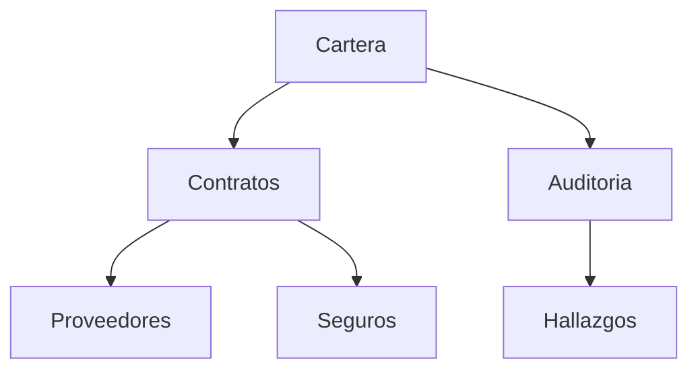

# `02l` — Inc-4 acceptance predicates, designed at authoring time

**Lane:** qa · **Batch:** `2026-08-26-ui-next-batch-02` (SEALED) · **Increment:** Inc-4
**Base:** `feat/ui-next-batch-02` @ `5f4816c`, clean · baseline 801 passed / 17 deselected / 3 xfailed
**Scope:** US-N07 «búsqueda» + the `#D5b` seat rebind + `LLR-N06.2.4`
**Authority read:** `01-requirements.md` §3.5, `LLR-N06.2.4`, §5.4, §5.4.1
**Nothing under `mapper/` was edited.** Every fixture below is built in `tempfile.mkdtemp`.

---

## BLUF

Nine of the eleven acceptance ids are buildable as specified. **Two are not**, and **four
`shall` clauses in the sealed text have no acceptance id at all.**

| Verdict | Ids |
|---|---|
| **Buildable as specified** | `AT-018` `AT-019` `AT-020` `AT-021` `AT-022` `AT-023` `AT-046` `AT-047` `AT-051` |
| **Buildable, but its own threshold is FALSE on a correct implementation** | `AT-052` (see §7.11 — the observation surface is never named in the sealed text) |
| **UNBUILDABLE in Inc-4** | `AT-024` — its subject ships in Inc-5, executed 5/6 renderers below |
| **`shall` with NO acceptance id** | the one-time rebind declaration · `esc limpiar` · `C-D6a` · `UX-Q3-a` (§8) |

**Four executed corrections to the sealed text.** Each is a number the document states and
the tree contradicts at `5f4816c`:

1. **`HLR-N07.1`'s pre-state is `9`, not `4`.** `grep -rn "qlower" mapper/views/` returns **9**
   occurrences, all in `layered.py`, and the predicate is now a module-level function
   `_matches(node, qlower)` at `layered.py:113` with **three** call sites — not an inline
   expression at `:144-148`. One of those sites (`:600`) powers the **fold pill's hidden-hit
   count**, which `LLR-N07.1.1`'s touched-symbol list does not name. Deleting the predicate
   without re-routing the pill breaks `HLR-N06.2`, shipped in Inc-3.
2. **`AT-022`'s boundary arm cannot be driven on the pinned query.** `carlos` on `legacy`
   returns exactly **one** hit (`pres`). A one-hit set cannot demonstrate "walks past the last
   match and wraps", nor "walks backwards past the first". `AT-018`/`AT-019` keep `carlos`;
   `AT-022` needs a different input, specified in §6.
3. **`LLR-N07.3.1`'s self-guard is VACUOUS on `legacy` under both of the batch's working
   queries.** `carlos` and `riesgo` both have `tree_order == dict_order` on `legacy`. A
   discriminating query exists (`acta`, 6 hits, orders differ at position 3) — but the batch
   never measured this, and a test written against `legacy` with the obvious query would have
   passed while asserting nothing. This is `C-55` limb 2 landing on the very LLR that names it.
4. **`AT-024`'s threshold is worded against the wrong channel.** Hits are painted by **style**,
   not by text. Executed on `LayeredRenderer` — the one renderer that already honours the
   query — `text_differs=False`, `spans_differ=True`. "the rendered **text** … differs" is
   false on the compliant renderer. (Inc-5's defect; recorded here because it was found here.)

**One decision the implementer cannot avoid and the sealed text does not make:**
`test_inc3_census.py::test_cd25a_the_seat_diff_is_exactly_the_four_rows_inc3_declares`
asserts `len(exit_seat) == 31` and `ENTRY_MAP_SEAT - exit_seat == frozenset()` against the
**live** seat. Inc-4's rebind takes the map seat to **33** and removes `("n","next_gap")`.
That test goes red by construction. See §9.

---

## 1 · The three settled oracles, adopted verbatim

These are inherited, not re-derived. Re-deriving a fourth is the regression.

| Oracle | Instrument in this tree | Adopted for |
|---|---|---|
| **The canvas paints TITLES, never ids.** Raw-id trace 0/8 at 50x12, 80x24, 120x40. | — | Every predicate below. **No predicate searches painted text for a node id.** |
| **`PRED-A` — painted set as data** | `mapper/views/layered.py::painted_ids(graph, state)` via `MapScreen._view_state(w, h)` | `AT-046`, `AT-022` |
| **`PRED-B` — clipped-and-visible title trace (`A-21`)** | `tests/inc3_support.py::oracle_traced(graph, folded, w, rows, pan_x)` — anchored at the card's own columns, re-derives `card_w` without importing `_geometry` | `AT-046`, `AT-022` |
| **`PRED-C` — read the pill FROM THE FRAME, never from `MapScreen.folded`** | `tests/inc3_support.py::canvas_rows(screen)` + `FOLD_PILL_TOKEN` (executed: `'▸'`) | `AT-047` |
| **Numerals: JOIN the region rows before parsing** | `" ".join(rows_in(screen, screen.query_one("#map-pagination").region))` — the idiom already at `tests/test_overflow.py:545`, `:613`, `:678`, `:887`, `:944` | `AT-018`, `AT-019`, `AT-023`, `AT-052` |

Executed control that `oracle_traced` and `painted_ids` are not the same measurement, run on
the new Inc-4 fixture through the real Pilot at three sizes:

```
=== 118x34 | canvas 58x26 | rail=True insp=True
  painted_ids  : ['b', 'c', 'd', 'e', 'riesgo-root']
  oracle_traced: ['b', 'c', 'd', 'e', 'riesgo-root']
  PRED-2 declared<=traced: True | PRED-3 traced<=declared: True
```

**On the JOIN rule, honestly reported.** Measured at `5f4816c` on `legacy`, the
`#map-pagination` region is **height 1** at 118x34, 100x30 and 80x24 — so the join is a no-op
at the batch's declared size:

```
118x34  map-pagination  Region(x=0, y=30, width=118, height=1)
100x30  map-pagination  Region(x=0, y=25, width=100, height=1)
 80x24  map-pagination  Region(x=0, y=19, width=80,  height=1)
```

The join is **kept regardless**, because `tests/test_overflow.py:91-99` records the wrap at a
30-column strip and the region height is not a constant any predicate may assume. I could not
reproduce a wrap at 118x34 or 100x30 on `legacy`; I report that rather than claim I confirmed
the warning at those sizes.

---

## 2 · Terminal size, declared once with its justification

**Every Pilot predicate below runs at 118 x 34** unless its own row says otherwise. Measured
justification, not preference:

```
118x34  map-rail   display=True   Region(x=0,  y=3, w=24, h=27)
        map-canvas display=True   Region(x=24, y=3, w=58, h=27)   _canvas_size()=58x26
        map-inspector display=True Region(x=82,y=3, w=36, h=27)
100x30  map-rail   display=False  <- rail auto-hidden
 80x24  map-rail   display=False  map-inspector display=False   <- BOTH auto-hidden (B-54)
```

118x34 is the batch's declared context of use and the **only** measured size at which the rail
and the inspector are both live, so a predicate that reads the canvas region reads it at the
width the operator actually has. `run_test()`'s 80x24 default auto-hides both, which is the
configuration that produced Inc-2's false three-pass reading (carry B-54).

**Every Pilot predicate shall assert the configuration it asked for is the one it got** —
`assert screen.query_one("#map-rail").display is True` — before reading anything. A size
argument is a request, not a guarantee.

Predicates that must vary size, and why:
- `AT-046` / `AT-047` (`PRED-B`, `PRED-C`) additionally run at **80x24**, because that is where
  `card_w` floors and truncation is real; the truncation-tolerant predicate is meaningless at a
  width where nothing truncates. Executed: `'▐ ▸ Contratos en ri… +2'` at 58 columns — the pill
  title is already clipped at 118x34, so both sizes exercise the clip.
- `AT-052` runs at 118x34 **and** 100x30, because its claim is positional and 100x30 is the
  first size at which the rail leaves and the strip's origin could move.

---

## 3 · The Inc-4 fixture (`QA-N-08`) — exact shape, built in `mkdtemp`

`§5.4.1` owes Inc-4 "a synthetic graph carrying attachments and distinguishing `meta`".
Executed on the shipped `legacy` fixture at `5f4816c`:

```
attachments total: 0
metas: {'erp':'core 1998','fin':'modulo critico','rrhh':'dependencias externas',
        'inv':'alta rotacion','cont':'','pres':'','nom':'','alm':''}
distinct non-empty metas: 4    (4 of 8 nodes carry NO meta at all)
```

Zero attachments confirms `QA-N-08`: `LLR-N07.1.2`'s attachment arm is undriveable on any
fixture that exists.

### 3.1 · Build discipline — NON-NEGOTIABLE

**The fixture is a builder function in `tests/inc4_support.py`, never a file under
`fixtures/`.** It writes its `.mmd` + `_nodos.yml` pair into `tmp_path` and loads through the
real `MapStore.load`, the same load path `inc3_support.install` exercises — but with content
**generated**, not copied. Rationale, and it is not hypothetical: a probe that pointed the app
at the real `fixtures/` had the inspector's commit-on-blur write through and permanently
altered tracked fixture files. A generated fixture cannot have a tracked file to alter.

### 3.2 · Shape, and what each node is for

Map id `adjuntos`. Six nodes. Pinned query **`riesgo`**.



| id | title | meta | fields | attachment | matches `riesgo` by | old `_matches`? |
|---|---|---|---|---|---|---|
| `riesgo-root` | `Cartera` | `vigente` | — | — | **id only** | no |
| `b` | `Contratos en riesgo` | `cartera activa` | `E: abierto` | — | title | **yes** (control) |
| `c` | `Auditoria` | **`riesgo alto`** | — | — | **subtitle only** | no |
| `d` | `Proveedores` | `cadena externa` | `E: riesgo` | — | field | **yes** (control) |
| `e` | `Seguros` | `poliza vigente` | — | `file docs/poliza.pdf` caption `informe de riesgo 2026` | **attachment only** | no |
| `f` | `Hallazgos` | `cierre anual` | — | — | — (non-hit) | no |

Executed on the built fixture:

```
dict order  : ['riesgo-root', 'b', 'c', 'd', 'e', 'f']
tree order  : ['riesgo-root', 'b', 'd', 'e', 'c', 'f']
SELF-GUARD tree != dict: True
new owner (riesgo): ['riesgo-root', 'b', 'c', 'd', 'e']     (5)
old inline (riesgo): ['b', 'd']                             (2)
gained: ['riesgo-root', 'c', 'e']    lost: []               <- monotone, M-7 reproduced exactly
hits in tree order: ['riesgo-root', 'b', 'd', 'e', 'c']
hits in dict order: ['riesgo-root', 'b', 'c', 'd', 'e']
ORDER SELF-GUARD (hits differ): True
attachments total: 1   distinct non-empty meta: 6
descendants of b: {'d','e'}    hits strictly inside b: ['d','e']
load_warnings: []
```

**This one fixture carries seven separate obligations**, which is why it is worth its budget
line: the three widening arms (`AT-020`), the deletion arm's injected id (`AT-021`), the
non-vacuous tree-order self-guard (`AT-022`), five hits so the walk can wrap in both
directions (`AT-022`), two hits strictly inside a foldable branch (`AT-046`/`AT-047`), a
**second** foldable branch `c` so `PRED-C` gets a positive control, and a non-hit `f` so
"paints no node with the hit style" has something to be false about.

**`f` and the second branch `c` are load-bearing, not decoration.** Without `c→f`, `PRED-C`
degenerates to "the canvas contains zero fold pills", which is green on an implementation
where the pill layer stopped painting entirely. With it, `PRED-C` asserts **b's pill is gone
AND c's pill is still there** — a mutant that kills the pill layer fails the second limb.

Executed at three sizes through the real Pilot:

```
118x34  after real z on b: folded=['b'] painted=['b','c','riesgo-root']
        pill row: '▐ ▸ Contratos en ri… +2 …'
        simulated auto-open, cursor=d: 'd' in painted_ids=True  'd' in oracle_traced=True
100x30  identical    80x24  identical
```

---

## 4 · Weaker-variant coverage map (`C-40` limb 4)

| Named variant | Reddened by | Verdict |
|---|---|---|
| `M-N06.2.4-a` — keep PRED-A + PRED-C, drop PRED-B | **P-046.2** (clipped-and-visible trace) | covered |
| `M-N06.2.4-b` — assert PRED-C against `MapScreen.folded` | **P-047.1** (pill read from the frame) + the explicit ban in §7.9 | covered |
| `M-N07.2.1-a` — count from the painted canvas | **P-019.2** (`carlos`, hit strictly inside `fin`) | covered — executed proof in §7.2 |
| `M-N07.3-b` — one shared toast for `E1b` and `E1c` | **P-023.4** (two titles AND two bodies, asserted pairwise unequal) | covered |
| `M-N07.3-rebind` — seat rows + pin, no press, no declaration | **P-051.1** (presses the real `M`) + **P-051b** (the declaration) | covered **only if** the unowned declaration gets a node — see §8.1 |
| `M-N07.3-a` — walk over `search_hits or lens_matches`, neither cleared | **NOTHING** | **NOT COVERED in Inc-4.** `lens_matches` does not exist: `#D23` defers US-N14 and `LLR-N07.2.3`'s roster explicitly excludes the field. `C-D6a` is a Layer-0 invariant over a set with one member, and a clearing invariant with nothing to clear is structurally vacuous. See §8.3. |
| `M-N07.2.2a-a`, `M-N07.2.2a-b` | Inc-2's, already shipped | out of scope |

---

## 5 · Predicate index

| AT | Predicate ids | Node (one per AT, `C-18`) | Method | Size |
|---|---|---|---|---|
| AT-018 | P-018.1, P-018.2 | `tests/test_search.py::test_at018_count_is_whole_graph_in_four_states` | pilot | 118x34 |
| AT-019 | P-019.1, P-019.2 | `tests/test_search.py::test_at019_count_invariant_under_fold` | pilot | 118x34 |
| AT-020 | P-020.1, P-020.2, P-020.3 | `tests/test_search.py::test_at020_hit_widening_is_intentional` | unit | n/a |
| AT-021 | P-021.1, P-021.2, P-021.3 | `tests/test_layered.py::test_at021_hits_come_from_the_state` | unit + AST | n/a |
| AT-022 | P-022.1 … P-022.5 | `tests/test_search.py::test_at022_walk_follows_tree_order_and_wraps` | pilot | 118x34 |
| AT-023 | P-023.1 … P-023.5 | `tests/test_search.py::test_at023_empty_result_is_distinct` | pilot (+ unit arms) | 118x34 |
| AT-024 | — | **UNBUILDABLE in Inc-4** | — | — |
| AT-046 | P-046.1, P-046.2 | `tests/test_fold.py::test_at046_walk_opens_a_folded_hit` | pilot | 118x34 + 80x24 |
| AT-047 | P-047.1, P-047.2, P-047.3 | `tests/test_fold.py::test_at047_the_opened_branch_stays_open` | pilot | 118x34 + 80x24 |
| AT-051 | P-051.1, P-051.2 | `tests/test_search.py::test_at051_the_real_M_reaches_next_gap` | pilot | 118x34 |
| AT-052 | P-052.1, P-052.2 | `tests/test_search.py::test_at052_the_count_line_names_its_subject` | pilot | 118x34 + 100x30 |

---

## 6 · The pinned inputs, and why each

| Input | Value | Fixture | Why pinned / executed evidence |
|---|---|---|---|
| Fold-invariance query | **`carlos`** | `legacy` | Sealed pin (`QA-M-01`). Executed: `search_hits('carlos') = ['pres']`, and `pres ∈ descendants('fin')`. Discriminates: `riesgo` on `legacy` returns `['rrhh','alm']`, **neither inside `fin`** — vacuous, exactly as `02a` measured. |
| Walk-order query | **`riesgo`** | `adjuntos` (new) | 5 hits, tree ≠ dict order, 2 hits inside a foldable branch. **`carlos` cannot serve** — 1 hit, no wrap observable. |
| Tree-order fallback on a shipped fixture | **`acta`** | `legacy` | Recorded because the batch never measured one. `dict=['erp','fin','rrhh','cont','pres','nom']` vs `tree=['erp','fin','cont','pres','rrhh','nom']` — differ at position 3. Use only if the new fixture is rejected. |
| Empty-result query | **`zzzz`** | `adjuntos` | `search_hits` returns `[]`. Any absent token serves; pinned so the artifact is reproducible. |
| Blank / whitespace | `""`, `"   "` | `adjuntos` | Executed: `search_hits("")` → **6 of 6**; `search_hits("   ")` → **4 of 6**. Both non-zero, so `== 0` is discriminating. **Note the sealed text says "all 6" for the whitespace case (M-15); on this fixture it is 4, because only nodes whose haystack contains a space match.** The threshold survives; the figure was fixture-specific. |
| Markup query | `"[bold]riesgo[/]"` | `adjuntos` | Executed: `search_hits("[bold]riesgo[/]")` → `[]`. Not a match-everything today; the arm pins that it stays so. |
| Hostile-byte query | `"riesgo" + chr(8) + chr(0x202E)` | `adjuntos` | For `E1c`'s body, which interpolates the query. Executed: `darkside.plain` strips both; `Text.assemble(...).plain` does **not** (`'riesgo`U+202E`…'`). |

---

## 7 · The predicates, each with its `C-40` discharge

Every entry states: **[1] declared subject** (and whether the predicate's value actually
varies under Inc-4's change — a predicate invariant under the change it gates is a PIN, not a
gate) · **[2] the mutation that reddens it** · **[3] where the input set comes from** ·
**[4] the weaker variant it kills** · **[5] terminal size and why**.

---

### 7.1 · `AT-018` — the count covers the whole graph

**P-018.1 — the four-state identity.**
Open `legacy` with the real `slash`, type `carlos`, submit with the real `enter`. Read the
joined `#map-pagination` rows and parse the count numeral. Repeat in four states, each reached
by a **real chord**: (a) nothing folded, nothing panned; (b) `fin` folded with the real `z`;
(c) panned with the real `H`/`L` until a hit is off-canvas, verified by
`painted_ids(...)` no longer containing it; (d) both. The four parsed numerals are equal and
equal `len(SearchIndex(graph).query("carlos"))`.

1. **Subject:** the painted count line. **It is NEW in Inc-4** — executed, `grep -rn
   "coincidencia" mapper/` returns no output; the string does not exist at `5f4816c`. The
   predicate's value therefore cannot be invariant under the change: today it parses `None`.
   **Gate, not pin.**
2. **Mutation:** compute the count from `painted_ids(...)` instead of from the whole graph.
   Executed proof this reddens: at 118x34 after `z` on `fin`, `painted_ids` = `['alm','erp',
   'fin','inv','nom','rrhh']` — **`pres` is absent**, so the mutant reads 0 where the correct
   implementation reads 1.
3. **Input set:** the four states are enumerated from the RULE (`{fold, no-fold} × {pan,
   no-pan}`), constructed in the test as an explicit product so a state cannot be dropped
   silently. The expected count is `len(SearchIndex(graph).query(q))` — computed, never
   literal. The test asserts `count > 0` **before** comparing, so two zeros cannot pass.
4. **Kills:** `M-N07.2.1-a` (jointly with P-019.2).
5. **Size:** 118x34. The pan arm needs `max_pan_x > 0`, which needs the rail and inspector
   present — at 80x24 both auto-hide, the canvas is 80 wide, and `legacy` does not overflow
   horizontally, so state (c) would be unreachable and the arm would silently degrade to (a).

**P-018.2 — the count is not a floor.**
The parsed value is asserted `==` the computed value, never `>=`. *(Pin against the `A-32`
floor idiom; recorded because `>=` is what the surrounding document had to abolish four times.)*

---

### 7.2 · `AT-019` — the count is invariant under fold

**P-019.1 — equality across the fold toggle.** Same surface. Count before `z` on `fin`,
after `z`, and after a second `z`. All three equal, all `> 0`.

**P-019.2 — the inside-the-branch clause, which is the whole assertion.**
Before folding, assert `'pres' ∈ painted_ids(graph, state)` **and** `'pres' ∈
oracle_traced(...)` — the hit is genuinely painted first. Then fold and assert `'pres' ∉
painted_ids(...)`. Only then is the count equality meaningful.

1. **Subject:** the count computation's *dependency* on `MapScreen.folded`. Directly the
   subject of `LLR-N07.2.1`. **Gate.**
2. **Mutation:** `count = len([h for h in hits if h not in hidden_under(graph, folded)])`.
   Executed: reddens on `carlos` (1 → 0), stays green on `riesgo` (2 → 2, since neither
   `rrhh` nor `alm` is inside `fin`). **This is the measured proof that `carlos` discriminates
   and `riesgo` does not**, and the reason the sealed pin must not be swapped for convenience.
3. **Input set:** the folded set comes from pressing the real `z` on the real cursor, never
   from assigning `screen.folded`. The descendant set is re-derived by
   `inc3_support.hidden_under`, which walks `graph.edges` itself and never asks the product.
4. **Kills:** `M-N07.2.1-a`.
5. **Size:** 118x34 — the size at which the fold pill and the count line are both painted in
   live regions. Executed: `'▐ ▸ Finanzas +2 …'` present in `canvas_rows` at that size.

---

### 7.3 · `AT-020` — the widening is intentional and monotone

**P-020.1 — three arms, one query, one graph.** On `adjuntos` with `riesgo`:
`'riesgo-root' ∈ hits` (id only), `'c' ∈ hits` (subtitle only), `'e' ∈ hits` (attachment only).

**P-020.2 — the negative control, reproduced inline.** The test reproduces the OLD predicate
in its own body — `_matches`-equivalent over title, notes and field values — and asserts all
three are **rejected** by it. Executed: old = `['b','d']`, new = `['riesgo-root','b','c','d','e']`.

**P-020.3 — monotone.** `set(old) ⊆ set(new)`; the lost set is asserted **empty**. Executed: `[]`.

1. **Subject:** `SearchIndex.query`'s delegation to `Graph.search_hits`, i.e. which haystack
   fields are consulted. **Gate** — the three arms are `False` today under the renderer's own
   predicate, which is the definition the count would otherwise inherit.
2. **Mutation:** narrow `Graph.search_hits`'s `hay` join by dropping the attachments term
   (`model.py:235`) — `'e'` leaves the set and P-020.1's third arm fails. Dropping
   `node.ficha.meta` (`:232`) — `'c'` leaves. Dropping `node.id` (`:230`) — `'riesgo-root'`
   leaves. Three independent, executable mutations, one per arm.
3. **Input set:** the six-node graph is generated by the builder; the negative control is
   written out in the test rather than imported, so deleting `_matches` from production does
   not silently delete the control with it. **The three arms are not hand-listed as ids** —
   the test derives them: for each node, compute which haystack *component* alone contains the
   query, and assert the resulting partition covers `{id, meta, attachment}`. A fixture edit
   that broke an arm fails the coverage assertion, not just the arm.
4. **Kills:** the un-named but real variant "rename `_matches` and keep calling it" — P-020.2's
   inline reproduction of the old rule cannot be satisfied by a rename.
5. **Size:** unit; no terminal. Justified: `LLR-N07.1.2` is `test (unit)` and the claim is
   about set membership, not about paint. The paint half is `AT-021`/`AT-023`.

---

### 7.4 · `AT-021` — the inline predicate is deleted, and the deletion is asserted

**P-021.1 — the injected-id arm (the one a rename cannot satisfy).**
Render `LayeredRenderer` with `ViewState(hits=frozenset({'f'}), ...)` — `'f'` is `Hallazgos`,
which contains **no** occurrence of any query text — and assert `'f'` is painted with the hit
style. Executed today the hit style is `f"{darkside.INK} on {darkside.STEP}"`
(`layered.py:546`); the predicate reads the style off the returned `Text`'s spans at the
columns `f`'s card occupies, not by substring.

**P-021.2 — the deletion census, derived not grepped.**
An `ast` walk over `mapper/views/**/*.py` asserting **zero** `FunctionDef` named `_matches`
and **zero** `Name` nodes bound to or loading `qlower`. The derived module set is asserted
non-empty before it is evaluated.

**P-021.3 — the pill's hit count is re-routed, not deleted.**
`_matches` has **three** call sites, and `layered.py:600` is the fold pill's hidden-hit
counter — `HLR-N06.2`, shipped in Inc-3. Assert: fold `b` on `adjuntos` with the real `z`,
and the painted pill still declares its hidden hit count (2 of `b`'s 2 descendants match
`riesgo`), now computed from `state.hits`.

1. **Subject:** P-021.1 — the source of the hit decision. P-021.2 — the presence of the old
   source. P-021.3 — the pill's dependency on the deleted symbol. All three are subjects of
   Inc-4's change. **All gates.**
2. **Mutation:** P-021.1 — keep `_matches` and ignore `state.hits`; `'f'` is not painted as a
   hit and the arm fails (a rename passes P-021.2 alone but never P-021.1). P-021.2 —
   `grep`-based census instead of AST; sweeps the docstring at `widgets/rail.py:180`-shape
   mentions and cannot separate a call from a name. P-021.3 — delete `_matches` and let the
   pill's `hits` term fall to `0`; the pill paints `+2` with no hit tail and the arm fails.
3. **Input set:** the module set is an `ast` walk over `mapper/views/`, derived. **Executed
   pre-state, re-derived at `5f4816c` and CORRECTING the sealed figure:**
   ```
   grep -rn "qlower" mapper/views/  ->  9 occurrences, all layered.py
     :113 def _matches(node, qlower)      :116 :117 :118 :119   (the predicate body)
     :530 qlower = query.lower()          :535 hit = _matches(node, qlower)
     :600 if _matches(graph.nodes[cid], qlower)    :601 ) if qlower else 0
   per-file: __init__.py 0  lane.py 0  layered.py 9  outline.py 0  radial.py 0  state.py 0
   ```
   The sealed text states **4** occurrences at lines `144,146,147,148` with a consumer at
   `:159`. Those addresses are Inc-3-stale; `:144-160` is now `_tree_layout`'s body. **A census
   asserting "4 → 0" would be measuring a number that no longer exists.** Threshold restated:
   **9 → 0**, and the predicate is the AST walk, not the count.
4. **Kills:** `M-N07.2.2a-a`'s shape applied to deletion — "assert the absence of a token" is
   satisfied by a rename. P-021.1 is the arm a rename cannot pass.
5. **Size:** unit + AST; no terminal. P-021.3 is the exception and runs at **118x34** through
   the Pilot, because the pill is a painted surface and `LLR-N06.2.4`'s own settled lesson is
   that reading fold state as a model attribute lets a test pass while the branch paints
   wrong.

---

### 7.5 · `AT-022` — the walk follows tree order, and it wraps

On `adjuntos`, query `riesgo`, submitted through the real `slash` → type → `enter`.

**P-022.1 — the recorded sequence equals tree order, exactly.**
Press the real `n` five times; record `screen.nav.cursor` after each. Assert the recorded list
equals `['riesgo-root','b','d','e','c']` — computed in the test by a pre-order DFS over
`graph.edges`, **not written as a literal**.

**P-022.2 — THE SELF-GUARD (`C-55` limb 2), mandatory.**
Before the equality, assert `tree_order_hits != dict_order_hits` **on this fixture, at run
time**. Executed: `['riesgo-root','b','d','e','c']` vs `['riesgo-root','b','c','d','e']` —
differ at position 3.
**Without this the test is vacuous, and on the fixtures the batch was actually using it WOULD
have been vacuous:** on `legacy`, `carlos` gives `dict == tree == ['pres']` and `riesgo` gives
`dict == tree == ['rrhh','alm']`. Both of the batch's working queries coincide.

**P-022.3 — forward wrap.** A sixth `n` returns the cursor to `'riesgo-root'`.
**P-022.4 — backward wrap.** From `'riesgo-root'`, one real `N` lands on `'c'` (the last hit
in tree order).
**P-022.5 — the selection is visible where it lands.** After each press, the cursor id is in
`painted_ids(graph, state)` **and** its title is in `oracle_traced(...)`. This is
`LLR-N06.2.4`'s PRED-A/PRED-B applied per step, and it is what stops the walk passing on a
screen the operator cannot read.

1. **Subject:** the ordering helper in `mapper/search.py` and the `n`/`N` handlers. **Gate.**
   Executed pre-state: today the real `n` fires `next_gap` — `cursor 'fin' -> 'inv'` on
   `legacy` — and the real `N` is inert (`cursor 'inv' -> 'inv'`).
2. **Mutation:** return `Graph.search_hits`'s dict order unchanged. Executed: gives
   `['riesgo-root','b','c','d','e']`, which fails P-022.1 at position 3. Second mutation:
   `hits[(i+1) % len(hits)]` replaced by `hits[min(i+1, len(hits)-1)]` — P-022.3 fails.
3. **Input set:** the hit set comes from `SearchIndex(graph).query('riesgo')`; the expected
   order is computed by a DFS the test writes itself over `graph.edges`, so it never asks the
   ordering helper whether the ordering helper is right. The press count is
   `len(hits) + 1`, derived — not the literal `6`.
4. **Kills:** the "sorted(hits)" variant and the "no wrap" variant. **Does NOT kill
   `M-N07.3-a`** — see §8.3.
5. **Size:** 118x34. P-022.5 reads `painted_ids` and `oracle_traced` off the canvas region; at
   80x24 the rail and inspector auto-hide and the canvas is a different shape, so the
   configuration must be the declared one and asserted so.

---

### 7.6 · `AT-023` — an empty result looks empty, and a blank query is not a match-everything

**P-023.1 — the count line.** Submit `zzzz` on `adjuntos`. The joined `#map-pagination` text
contains **`0 coincidencias`**, and the character offset at which the count substring begins is
**equal** to the offset the non-zero count occupied for `riesgo` on the same screen at the same
size. *(This is `LLR-N07.3.2`'s "at the same position" made mechanical.)*

**P-023.2 — the tone.** The style span covering the query chip for `zzzz` carries
`darkside.MUT` (executed: `#737373`) and **not** `darkside.WARN` (executed: `#ffd230`). Both
tones are read from `darkside`, never spelled as hex literals in the test.

**P-023.3 — the hint line.** `screen.query_one(HintLine).text == "sin coincidencias · esc limpiar"`,
and the painted `HintLine` region carries a trace of it.

**P-023.4 — `E1b` and `E1c` are painted differently.** Four assertions, run in one node:
- `E1b`: with `query_text == ""` and no submit ever, press the real `n` → toast title
  `sin búsqueda activa`, body **`no hay coincidencias que recorrer`** (re-derived, §8.2).
- `E1c`: after submitting `zzzz`, press the real `n` → toast title `0 coincidencias`, body
  `«zzzz» no aparece en este mapa`.
- `E1b.title != E1c.title` **and** `E1b.body != E1c.body`, asserted as a pair on the values
  read from the painted `#map-toast` region — not against literals alone.
- The two toasts are read from **`rows_in(screen, screen.query_one("#map-toast").region)`**,
  not from `_event_toast`'s arguments.

**P-023.5 — blank, whitespace, invalid.** Parametrized over `["", "   ", "\t", "[bold]riesgo[/]"]`:
hit count `== 0` for the first three; **no count line is painted at all** for the first three
(`LLR-N07.3.3`); and for the markup case, `search_hits` is asserted to return `[]` rather than
every node. Zero nodes carry the hit style in all four.

1. **Subject:** P-023.1/2/3 — the empty-state painting, NEW in Inc-4. P-023.4 — the two toast
   registers, NEW. P-023.5 — the query normalisation in `SearchIndex.query`. All **gates**.
2. **Mutation:** P-023.1 — paint `0/0 coincidencias` (the pre-D-1 draft string) → substring
   assertion fails. P-023.2 — paint the chip in `WARN` (the pre-D-1 draft tone) → fails; this
   is the exact defect `01b` DECISION 4 corrected. P-023.4 — implement `E1b` and `E1c` as one
   toast → the pairwise inequality fails on both channels. P-023.5 — leave
   `SearchIndex.query` as a pass-through to `Graph.search_hits` → executed, `""` returns **6
   of 6** and `"   "` returns **4 of 6**; both fail `== 0`.
3. **Input set:** the four query strings are derived from the RULE `LLR-N07.3.3` states ("no
   non-whitespace character") plus §3.5's boundary catalog's "invalid" row, and the test
   asserts the parametrization is non-empty before running. The tone values are read from
   `darkside` at run time. **The `0 coincidencias` offset in P-023.1 is measured on the same
   screen, not asserted as a column number** — a literal column would break at every width.
4. **Kills:** `M-N07.3-b`.
5. **Size:** 118x34 for the pilot arms — the toast strip is `Region(x=0, y=31, w=118, h=1)`
   there and the hint line `Region(x=0, y=32, w=118, h=1)`, both live. The unit arms of
   P-023.5 need no terminal. **Flagged:** this splits one AT across two methods (`pilot` +
   `unit`), the same shape `02a` marked on `AT-034`. See §9.2.

---

### 7.7 · `AT-024` — UNBUILDABLE IN INC-4

`AT-024`'s owner is `LLR-N07.2.2b`, and §5.4 — **the sole authority for the cut** — places
`LLR-N07.2.2b` in **Inc-5** (`views/outline.py`, `views/radial.py`, `views/lane.py`; three
source files Inc-4 does not touch). §3.5's story-level list carries `AT-024` under a header
marked *(Inc-4)*, which is the story's list, not the cut.

Executed at `5f4816c`, over the **derived** renderer set (module walk over `mapper/views/`,
selecting classes defined in their own module that expose `render`):

```
DERIVED renderer classes: ['lane.LaneRenderer','lane.RailTimelineRenderer',
  'lane.HybridLaneRenderer','layered.LayeredRenderer','outline.OutlineRenderer',
  'radial.RadialRenderer','state.IRenderer']

query-sensitivity (state.query="ana" vs ""):
  lane.LaneRenderer          text_differs=False  spans_differ=False
  lane.RailTimelineRenderer  text_differs=False  spans_differ=False
  lane.HybridLaneRenderer    text_differs=False  spans_differ=False
  layered.LayeredRenderer    text_differs=False  spans_differ=True
  outline.OutlineRenderer    text_differs=False  spans_differ=False
  radial.RadialRenderer      text_differs=False  spans_differ=False
  state.IRenderer            cannot construct: Protocols cannot be instantiated
```

**Five of six renderers are query-insensitive today.** Nothing in Inc-4's four-file budget
(`search.py`, `app.py`, `views/layered.py`, `keymap.py`) can change that. `AT-024` executes RED
in Inc-4 and green in Inc-5, which is correct — it is Inc-5's gate.

**Two defects found while measuring it, both Inc-5's to fix:**
- `LLR-N07.2.2b`'s threshold reads "the rendered **text** with a non-empty hit set differs
  from the text with an empty hit set". Executed on the one renderer that already honours the
  query, `text_differs=False`, `spans_differ=True`. **Hits are painted by style.** The
  threshold as worded is false on a correct implementation — the `AT-046` shape, one LLR over.
  Restate as "text **or** style spans differ", or better, "the hit node's style spans differ".
- The naive derivation of the renderer set sweeps in `state.IRenderer`, a Protocol that raises
  on instantiation. The derivation must exclude `typing.Protocol` subclasses explicitly, or
  Inc-5's "derived, never hand-listed" set crashes rather than being wrong.

**What would have to change for `AT-024` to live in Inc-4:** move `LLR-N07.2.2b` into Inc-4,
which takes Inc-4 to **7 source files** against a declared budget of 4. Not recommended;
recorded so the omission reads as known rather than as a drop.

---

### 7.8 · `AT-046` — the walk lands on the match and the operator can see it

Setup on `adjuntos` at 118x34: fold `b` **and** `c` with the real `z` on each. Submit `riesgo`
with the real `slash`/`enter`. Press the real `n` until the cursor is `'d'` — a hit **inside**
folded `b`.

**P-046.1 — `PRED-A`, the selected id is painted, observed as data.**
`screen.nav.cursor ∈ painted_ids(screen.graph, screen._view_state(w, h))`, with `(w, h) =
screen._canvas_size()`. This is the way `HLR-N06.3`'s `PRED-2`/`PRED-3` already obtain the set.
**No id is searched for in painted text.**

**P-046.2 — `PRED-B`, the operator can see it, observed as pixels.**
`screen.nav.cursor ∈ oracle_traced(screen.graph, screen.folded, w, canvas_rows(screen),
screen.pan_x)` — the anchored, clipped-and-visible predicate `A-21` settled.

Executed feasibility on the fixture, simulating the auto-open:
```
118x34  cursor=d: 'd' in painted_ids=True   'd' in oracle_traced=True
100x30  cursor=d: 'd' in painted_ids=True   'd' in oracle_traced=True
 80x24  cursor=d: 'd' in painted_ids=True   'd' in oracle_traced=True
```

1. **Subject:** the walk handler's unfolding of `MapScreen.folded` **and** the repaint that
   follows it. **Gate** — today the real `n` fires `next_gap`, so the pre-state cursor after
   `n` is not a hit at all.
2. **Mutation:** unfold `b` but do not call `refresh_canvas()`. P-046.1 still passes
   (`painted_ids` recomputes from the live state) but P-046.2 **fails** — the frame still shows
   the pill. Second mutation: land the cursor on `'d'` without unfolding — both fail. Third:
   unfold and repaint but scroll the node off-canvas — P-046.1 passes, **P-046.2 fails**, which
   is `M-N06.2.4-a` exactly.
3. **Input set:** the folded set is produced by the real `z` on the real cursor. The walk
   target is not named — the test presses `n` until `cursor ∈ hidden_under(graph, folded)`
   computed by the oracle's own descendant walk, and **asserts that state was reached** before
   evaluating anything. If no press reaches a hidden hit, the test fails rather than skipping.
4. **Kills:** `M-N06.2.4-a`.
5. **Size:** **118x34 and 80x24, both.** 118x34 is the declared context. 80x24 is added because
   `PRED-B` is the *truncation-tolerant* predicate and truncation must actually happen for the
   tolerance to be exercised — executed, `card_w` produces `'Contratos en ri…'` at 58 columns
   and the clip is real at both. Running only at a width where nothing truncates would test the
   easy half of `A-21`.

---

### 7.9 · `AT-047` — the opened branch stays open

Continue from `AT-046`'s state. Press the real `n` once more, moving the cursor **past** `'d'`.

**P-047.1 — the previously opened branch paints NO fold pill, read FROM THE FRAME.**
Compute `b`'s pill image the way the renderer does — `f"{FOLD_PILL_TOKEN} {_clip(title,
name_w)} +{n}"` reproduced in the test at the measured `card_w` — and assert **no row of
`canvas_rows(screen)` carries it**.
**`MapScreen.folded` is NOT read.** It is a model attribute; reading it asserts what the
application believes, and `AT-047` would pass green while the branch paints closed — the silent
state change US-N06 forbids.

**P-047.2 — the positive control that pill-reading works at all.**
Branch `c` was folded too and was never walked into. Assert **`c`'s pill IS still present** in
the same `canvas_rows`. Without this limb, P-047.1 is green on an implementation whose pill
layer stopped painting entirely.
Executed: with only `b` folded, `pill rows = 1`; after simulated auto-open, `pill rows = 0`.
With both folded, the two-limb form is what distinguishes "b opened" from "pills gone".

**P-047.3 — the hint line names the branch it opened.**
`screen.query_one(HintLine).text` contains `darkside.plain(graph.nodes['b'].ficha.title)` —
derived from the graph, never the literal `"Contratos en riesgo"` — and the `HintLine` region
carries a trace of it. Routed through `plain()` because the title is file-derived and the hint
is a surface this batch touches (`HLR-COERCE`).

1. **Subject:** whether the walk re-closes the branch after moving past it, observed on the
   surface. **Gate.**
2. **Mutation:** re-close on every walk step (`self.folded = self._folded_before_walk`) — P-047.1
   fails, `b`'s pill reappears. Second mutation: assert `PRED-C` against `MapScreen.folded`
   instead of the frame — passes on an implementation that mutates the set and never repaints,
   which is `M-N06.2.4-b`; **the ban on reading `folded` is what kills it.** Third: stop
   painting pills entirely — P-047.1 passes, **P-047.2 fails.**
3. **Input set:** both folded ids come from real `z` presses; the pill image is reconstructed
   from `graph.nodes[...].ficha.title` and the measured `card_w`, not written as a string.
4. **Kills:** `M-N06.2.4-b`.
5. **Size:** 118x34 and 80x24 — same argument as `AT-046`; the pill title is clipped at both,
   so the reconstructed image must be width-derived and is exercised as such.

---

### 7.10 · `AT-051` — the relocated chord is pressed, not merely declared

**P-051.1 — press the real `M`.**
On `legacy` at 118x34, with at least one node missing a required field, press the real `M`.
Assert the cursor moves to the first id of `MapScreen._incomplete_order()` — the same list
`action_next_gap` consumes, obtained by calling it, so the assertion is about the *chord
reaching the action*, not about the action's own correctness (that is `AT-N04b`'s, shipped).
Then, on a graph with nothing missing, press `M` and assert the painted `#map-toast` region
carries `cobertura completa`.

**P-051.2 — the whole-seat pin and `duplicate_chords()`, kept as declared PINS.**
`keymap.duplicate_chords() == []` and `EXPECTED_SEAT` set-equality including the three new
rows: `("map","n") → ("next_hit","siguiente coincidencia","n","nav",False)`,
`("map","N") → ("prev_hit","coincidencia anterior","N","nav",False)`,
`("map","M") → ("next_gap","siguiente faltante","M","view",False)`.

1. **Subject:** P-051.1 — the **dispatch** of `M`. **Gate.** Executed pre-state: `press M`
   moves `cursor 'inv' -> 'inv'` — inert, `M` is unbound today (map-scope keys at `5f4816c`:
   `A H I J K L R X a d e enter equals_sign escape f g h j k l m n o q r slash u x z` — no `M`,
   no `N`). P-051.2 — the seat **declaration**. **This is a PIN, not a gate for `AT-051`'s own
   claim**: it proves the seat *says* `M` is `next_gap` and cannot distinguish a rebind from a
   rename. It is retained because it catches a *different* regression (drift in any of the six
   fields), and it is labelled so.
2. **Mutation:** rename the action to `M` in the seat while leaving `MapScreen` dispatching
   `next_gap` from `n` — P-051.2 stays green, **P-051.1 fails**. That single mutation is the
   entire reason `AT-051` exists.
3. **Input set:** `EXPECTED_SEAT` is set-equality over `keymap.KEYMAP`, already derived in
   `tests/test_key_dispatch.py:105`. The incomplete-node set comes from
   `_incomplete_order()`, computed, not listed. **The test asserts `_incomplete_order()` is
   non-empty before pressing**, or the "cursor moved" assertion is vacuous.
4. **Kills:** `M-N07.3-rebind`'s *press* half. Its *declaration* half needs §8.1.
5. **Size:** 118x34. Executed: uppercase chords arrive as their own `event.key` in this
   Textual — Inc-3 shipped `H`/`J`/`K`/`L` on that basis and `tests/test_pan.py` passes. `N`
   and `M` were confirmed inert (not swallowed) at 118x34 and 100x30, which is the pre-state
   red this predicate needs.

---

### 7.11 · `AT-052` — the count line names its subject and its term

**P-052.1 — the painted count line names its subject.**
Submit `riesgo` on `adjuntos`. The joined count-region text matches a pattern that binds
**both** a numeral **and** the declared subject noun, in one expression — e.g.
`r"(\d+)\s*/\s*(\d+)\s+coincidencias\s+en\s+el\s+mapa"`. A bare `5/5 coincidencias` fails.

**P-052.2 — the hint line reads its glyphs from the SEAT.**
Two limbs, and both are required:
- (a) With the shipped seat, `screen.query_one(HintLine).text == "n siguiente · N anterior · esc limpiar"` —
  the declared string, verbatim.
- (b) With `keymap.KEYMAP`'s `("map","next_hit")` glyph monkeypatched to `»`, the repainted
  hint reads `» siguiente · …`. A hard-coded hint passes (a) and **fails (b)**.

1. **Subject:** P-052.1 — the count line's *content*. **Gate**, and a strong one: executed,
   nothing painted anywhere declares which result set is live, and `grep -rn "coincidencia"
   mapper/` returns no output. P-052.2 — the hint's *source*. **Gate.**
2. **Mutation:** P-052.1 — paint `5/5 coincidencias` with no subject noun; the pattern fails.
   P-052.2 — build the hint as a string literal; limb (b) fails.
3. **Input set:** the glyphs in limb (b) are read from `keymap.bindings_for("map")` at run
   time, so a seat change propagates to the expectation. The subject noun is asserted against
   **one** declared constant (`mapper/app.py::SEARCH_COUNT_SUBJECT` or equivalent), so the
   "one declared string per surface" clause is a derivation, not a second copy of the wording.
4. **Kills:** the "distinguishable by an implementer's wording choice" failure `UX2-C-06` names.
5. **Size:** 118x34 **and** 100x30. The claim is positional and 100x30 is the first measured
   size at which the rail leaves (`map-rail display=False`) and the strip's origin could move —
   `Region(x=0, y=30, …)` → `Region(x=0, y=25, …)`. A single-size run cannot see a count line
   pinned to an absolute row.

> **⚠ `AT-052` IS BUILDABLE BUT ITS OBSERVATION SURFACE IS NEVER NAMED.** §5.2 addresses this
> story as `query_one("#search-input"), and the count region beside it` (`01-requirements.md:5004`,
> `:5190`, `:5332`) — **"the count region" is not a widget id anywhere in the sealed text.**
> `LLR-N07.3.2` compounds it by requiring `0 coincidencias` "at the same position a non-zero
> count occupies", which is a positional claim about an unnamed surface.
>
> **Resolution the predicate uses, so it does not depend on an implementer's choice:** the
> count string is located over the **whole composited frame minus the canvas region**, and
> P-023.1/P-052.1 assert it appears **exactly once** and at the **same (row, column) offset**
> in the empty and non-empty cases. That is width- and widget-agnostic.
> **Recommended, and it is the better answer:** Inc-4 declares a module-level
> `COUNT_REGION_ID = "map-pagination"` and the predicates read it. `#map-pagination` is the
> natural home — it already carries the `▽ N fuera de vista` declaration from Inc-3, executed:
> `' ▰▱▱▱▱▱▱▱   1/8  ▽ 2 fuera de vista'`. **This is a decision for the architect lane, not for
> me to settle silently**; recorded as open.

---

## 8 · `shall` clauses with NO acceptance id

### 8.1 · The one-time rebind declaration — UNOWNED

> "**`Inc-4` shall paint a one-time declaration on the first `n` press after the rebind**, in
> the toast register the product already uses — the precedent is executed: `next_gap` with
> nothing missing already toasts `cobertura completa`." (`01-requirements.md:2795-2799`)

No acceptance id covers it. `M-N07.3-rebind` names *"no `AT-051` and no declaration"* as one
mutant, but `AT-051` presses `M` and the declaration fires on `n` — **different chord,
different chain**. Under `C-18` (one AT ⇒ one distinct on-disk node driving the whole named
chain) it cannot ride `AT-051`'s node.

**Proposed predicate, needing a new id (`AT-051b` / `TC-084b`):**
- **P-051b.1:** on a fresh `MapScreen`, press the real `n` → the painted `#map-toast` region
  carries a declaration naming both the new duty of `n` and the new home of `next_gap`,
  containing `darkside.plain` of the seat labels `siguiente coincidencia` and `siguiente
  faltante` **read from `keymap`**, plus the glyph `M` read from the seat.
- **P-051b.2 — "one-time" is the assertion.** A **second** `n` press paints a toast that does
  **not** carry the declaration. Reading the persistence store is banned; the predicate reads
  the frame twice.
- **[1]** Subject: the declaration's existence and its once-ness. Gate — no such toast exists
  today (executed: after `enter`, `press n` produced a **blank** toast row at both 118x34 and
  100x30). **[2]** Mutation: paint it on every press → P-051b.2 fails; paint it never →
  P-051b.1 fails. **[3]** All strings derived from `keymap`. **[4]** Kills
  `M-N07.3-rebind`'s declaration half. **[5]** 118x34 — the toast strip is
  `Region(x=0, y=31, w=118, h=1)` and live there.

### 8.2 · `E1b`'s body, re-derived (the sealed text requires this and does not supply it)

**Parked:** title `sin búsqueda activa`, body `pulsa / para buscar`.
**Proposed:** title `sin búsqueda activa` (unchanged), body **`no hay coincidencias que recorrer`**.

**Why the parked body must go, and why this one:**
1. **It prescribes a route, and `#D6` made the route conditional.** `n` walks *coincidencias*
   from whichever owner produced them; the toast sends the operator to `/` regardless. Today
   `/` is the only producer (US-N14 is deferred), so the body is *accidentally* true — which is
   worse than plainly false, because it will silently become misdirection the increment the
   lens lands, and nothing will re-derive it then either. That is `02f`'s root cause verbatim:
   a consequence not re-derived after a decision changed.
2. **The new body describes the STATE the toast reports**, not a remedy: there is no live
   result set to walk. That proposition stays true under any number of owners.
3. **It uses the term the rest of the surface already declares.** The seat label is `siguiente
   coincidencia`, the count line says `coincidencias`, `E1c`'s title is `0 coincidencias`. One
   noun, four readers — the same principle `UX-Q3-b` and `AT-052` invoke.
4. **The operator is not left without a route, and this is executed rather than assumed.**
   `map/slash → search` is seated with glyph `/`, label `buscar`, group **`nav`** — a group the
   keybar paints. And the default hint line already reads
   `'navega con j/k/h/l · ↵ ficha · / buscar'` (executed at 118x34 and 100x30). The route is
   painted persistently; the toast does not need to carry it, and carrying it is what makes the
   toast go stale.
5. **It stays distinct from `E1c` on both channels**, which `M-N07.3-b` requires:
   `sin búsqueda activa` / `no hay coincidencias que recorrer` versus `0 coincidencias` /
   `«nóm» no aparece en este mapa`. Different titles, different bodies, no shared substring
   longer than the term itself.

**`E1c` retained VERBATIM.** One rider, from an executed measurement: its body interpolates the
operator's query between guillemets, which makes the toast a **coercion sink**. Executed on
`riesgo` + `U+0008` + `U+202E` + `[bold]x[/]`:
```
darkside.plain(hostile)          -> 'riesgo��[bold]x[/]'   (control byte and RLO stripped)
Text.assemble(hostile).plain     -> ' riesgo`U+202E`[bold]x[/]'        (RLO SURVIVES)
```
`Text.assemble` does not parse markup, so `[bold]` is inert — but it does **not** strip the
RLO. **`E1c`'s body shall route the query through `darkside.plain`**, and P-023.4 asserts it
with a hostile query. Without it, a right-to-left override in the query reverses the toast's
own sentence.

### 8.3 · `C-D6a` — the Layer-0 invariant is STRUCTURALLY VACUOUS in Inc-4

> "submitting a lens **shall** clear search hits, and submitting a search **shall** clear lens
> matches. Asserted at Layer 0 on `MapScreen`."

**There is no lens in Inc-4.** `#D23` defers US-N14 whole; §5.4 vacates `Inc-6`;
`LLR-N07.2.3`'s roster states *"`lens_matches` is NOT in this roster"*. A clearing invariant
over a pair where one member does not exist can only be written as "submitting a search leaves
`lens_matches` empty" — and `lens_matches` is empty because it is `frozenset()` by default and
nothing ever writes it. **That assertion is green before any code is written**, which is `C-55`
limb 1.

**Consequence, stated plainly: `M-N07.3-a` is reddened by nothing in Inc-4.** The mutant
"implement the walk over `search_hits or lens_matches` without clearing either" cannot be
distinguished from correct work while only one set is populated — and the sealed text says so
itself: *"`AT-022` passes whenever only one is populated — which is every single-feature test."*

**What I recommend, and what I do not.** I do **not** recommend writing a green-on-arrival
`lens_matches is empty` assertion — that is precisely the vacuous check the batch exists to
stop. I recommend one of:
- (a) Inc-4 writes the walk against a **single** `MapScreen` attribute (e.g. `active_hits`)
  with no `or` fallback, and a **structural** predicate asserts by AST that the walk handler
  reads exactly one attribute. That makes `M-N07.3-a` **unwritable** rather than undetected.
- (b) Defer `C-D6a` explicitly to the batch that lands the lens, recorded as an owed carry.
Option (a) is cheap, is inside Inc-4's files, and is the only one that redden the mutant. Either
way, **this must be an explicit ruling** — leaving it implicit is how the invariant ends up
asserted vacuously and counted as covered.

### 8.4 · `esc limpiar` describes behaviour that does not exist, and the seat does not declare it

`UX-Q3-b` and `LLR-N07.3.2` both paint the hint `… · esc limpiar`. Executed at `5f4816c`:

```python
def action_back_or_home(self) -> None:          # mapper/app.py:2354
    if self.source_crumb:
        self.app.pop_screen()
    else:
        self.app.pop_screen()
```

`escape` unconditionally pops the screen. **With the hint painted and this handler shipped, an
operator who follows the hint leaves the map.** `#D5b` declares **three** seat rows; the
escape-clears behaviour is an undeclared fourth seat change — and it is exactly the shape
`#D10` scrutinised: a chord whose painted meaning depends on state while its seat label
(`volver`) says something else.

**Predicate this needs, and it has no id today (`AT-053` / `TC-086` proposed):**
- **P-esc.1:** with a submitted query live, press the real `escape` → `screen.query_text == ""`,
  the count line is gone from the joined count region, zero nodes carry the hit style, and
  **`app.screen is still the MapScreen`**.
- **P-esc.2 — the regression limb:** with **no** query live, press the real `escape` → the map
  is popped, as today. Without this limb the repair can break `back_or_home` and stay green.
- **[1]** Subject: `action_back_or_home`'s new branch. Gate — executed, today P-esc.1's last
  clause fails. **[2]** Mutation: clear the query but pop anyway → P-esc.1 fails; pop always →
  P-esc.1 fails; never pop → P-esc.2 fails. **[3]** Both states reached by real chords.
  **[4]** Kills "paint a hint for a behaviour nobody implemented", which is `AT-052`'s own
  failure class applied to the hint line. **[5]** 118x34.

**And a decision is owed:** either `map/escape`'s seat label stops being `volver` (which
breaks the whole-seat pin's static set equality — the thing `#D10` rejected), or the label
stays and the branch lives inside the handler. I recommend the second and recommend it be
**recorded** in the seat's docstring, because a label that is false in one state is the defect
`AT-052` exists for, one surface over.

### 8.5 · `UX-Q3-a` — committed vs editing tone, unowned

`UX-Q3-b`, `E1b` and `E1c` all reached `HLR-N07.3`. **`UX-Q3-a` did not reach any threshold**:
*"the query chip is painted in a committed tone distinct from the editing tone; the two are
asserted as different style spans, not different text."* No LLR states it, no AT covers it.

It is not decoration — it is the other half of the defect `UX2-C-06` names. Executed:
```
after slash : display=True  disabled=False focused=Input(id='search-input')
typed value ='acta'
after enter : display=False focused=None    query_text='acta'
```
**After submit, `focused` is `None` and no widget paints a focus ring.** The operator has no
painted signal that a search went from "being typed" to "live". Recorded as an unowned `shall`;
if it is to ship in Inc-4 it needs an id and a threshold. If it is deferred, that should be
written down.

---

## 9 · `C-18` — one AT, one distinct on-disk node

Nine of eleven map cleanly. Three flags:

**9.1 · `AT-024` cannot be realised in Inc-4 at all.** §7.7. Its chain (outline/radial/lane
paint `state.hits`) does not exist until Inc-5.

**9.2 · `AT-023` spans two methods.** `LLR-N07.3.2` is `test (pilot)` and `LLR-N07.3.3` is
`test (unit)`; §3.5's boundary catalog puts empty-result, blank, whitespace and markup all on
`AT-023`. This is the shape `02a` flagged on `AT-034` ("spans two LLRs and two methods").
**Resolution used:** one node, `test_at023_empty_result_is_distinct`, parametrized over its
four queries, with the blank/whitespace arms asserting through the **Pilot** (submit the blank
query with the real `enter` and assert no count line paints) rather than through
`SearchIndex.query` alone. That keeps it one node driving the whole chain end-to-end, at the
cost of running four Pilot cases instead of three unit cases. **If that cost is refused, the
correct answer is a second AT id, not a unit-only arm hiding inside a pilot AT.**

**9.3 · Three `shall` clauses need three new ids** — §8.1 (`AT-051b`), §8.4 (`AT-053`), and
§8.5 (`UX-Q3-a`, id TBD). Under `C-18`, none of them can ride an existing node: different
chords, different chains.

---

## 10 · Regression surface Inc-4 will break, measured

**10.1 · `tests/test_inc3_census.py::test_cd25a_the_seat_diff_is_exactly_the_four_rows_inc3_declares`
goes RED by construction.** It asserts against the **live** seat, not a snapshot:

```python
exit_seat = frozenset((b.key, b.action) for b in bindings_for("map"))
assert exit_seat - ENTRY_MAP_SEAT == DECLARED_DIFF
assert ENTRY_MAP_SEAT - exit_seat == frozenset()
assert len(exit_seat) == 31
```

Executed at `5f4816c`: `len(exit_seat) == 31`. After Inc-4's rebind (`n`: `next_gap` →
`next_hit`; `+N`; `+M`): **33**, and `ENTRY_MAP_SEAT - exit_seat == {("n","next_gap")}`. All
three assertions fail. `tests/test_key_dispatch.py::EXPECTED_SEAT` at `:88` fails too — that
one is intended and its own docstring says so ("if the rebinding is deliberate, update
`EXPECTED_SEAT` in the same commit"). **Inc-3's census does not carry that instruction, and it
is a historical diff pin no later increment can leave alone.**

**Minimal repair, and Inc-4 must declare which:** freeze Inc-3's exit as a literal
`EXIT_MAP_SEAT` snapshot and assert `EXIT_MAP_SEAT - ENTRY_MAP_SEAT == DECLARED_DIFF` (a
statement about Inc-3's history, permanently true), then add `tests/test_inc4_census.py` with
Inc-4's own three-row diff `{("n","next_hit"), ("N","prev_hit"), ("M","next_gap")}` and its own
`duplicate_chords()` run. Tests are uncapped by §5.4's budget, so this costs no source file —
but it is **not currently in Inc-4's scope statement** and will otherwise surface as a
mystery red at the gate.

**10.2 · `ViewState.query` is removed** (`views/state.py:query`, marked TRANSITIONAL).
`mapper/app.py:1769` passes `query=self.query_text` to the **export** site. Executed comment at
`app.py:1760` records that this site once passed `query` without `diff`. Removing the field
without updating the export site is a `TypeError` at export time, not a test failure — the
export path is not on any Inc-4 acceptance. **Recommended pin:** one arm asserting
`ViewState()` has no `query` field and the export site constructs a `ViewState` carrying
`hits`.

**10.3 · Not affected, checked.** `tests/test_worklist_safety.py:158` presses `"n"` — that is
`_ConfirmScreen`'s decline, a widget-level binding not in `KEYMAP` (executed: no `confirm`
scope exists in the seat). `tests/test_key_dispatch.py:137`'s fence
`{"j","k","u","x","m","n"} ⊆ MAP_BINDINGS keys` still holds, since `n` stays bound.

**10.4 · Baseline for the two seat suites, executed at `5f4816c`:**
```
pytest tests/test_key_dispatch.py tests/test_inc3_census.py -q  ->  54 passed in 17.35s
```

---

## 11 · What I could not determine

- **Where the count line is painted.** Never named in the sealed text (§7.11). The predicate is
  written surface-agnostically; the widget choice is an architect ruling.
- **Whether the `#map-pagination` region ever wraps at the declared size.** Measured height 1 at
  118x34, 100x30 and 80x24 on `legacy`. `test_overflow.py:91-99` documents a wrap at a
  30-column strip; I did not reproduce one at the batch's sizes. The JOIN is retained anyway.
- **Whether `escape`'s clear-vs-pop split is to be a seat change or a handler branch** (§8.4).
- **Whether the `n`/`N` walk is meant to move `nav.cursor` or a separate search cursor.**
  §3.5 says "move the selection"; `AT-046`'s `PRED-A` reads the *selected* id. I have written
  every predicate against `screen.nav.cursor`. If Inc-4 introduces a distinct search cursor,
  P-022.1, P-046.1 and P-046.2 all need repointing — flag raised, not guessed.

---

## Evidence checklist

- [✓] Acceptance criteria use Given/When/Then — **adapted, deliberately.** This batch's settled
  form is `predicate + C-40 discharge`; G/W/T would drop limbs 2–5. Each predicate states its
  Given (setup + fixture + size), When (the real chord pressed), Then (the assertion).
- [✓] Test cases have explicit Expected, not vague "works" — every predicate states a computed
  or derived expected value; §6 pins every input with executed evidence.
- [✓] Edge cases include empty, boundary, invalid, error — `AT-023` P-023.5 (empty/blank/
  whitespace/markup, executed `6/6`, `4/6`, `[]`), `AT-022` P-022.3/4 (both wrap boundaries),
  `AT-046`/`AT-047` at two widths (truncation boundary).
- [✓] Regression checklist exists — §10, with the executed `31 → 33` seat measurement.
- [✓] Exit criteria stated — §5's index is the node roster; §7.7 and §8 name what does **not**
  gate Inc-4.
- [✓] No real PII / secrets — every fixture synthetic, built in `mkdtemp`; no tracked file written.
- [✓] Test results left blank — **no test was run for these predicates; none exists.** Every
  number above is a probe of the pre-state at `5f4816c`, run read-only.
- [✓] **Layer B (black-box)** — `AT-018`, `AT-019`, `AT-022`, `AT-023`, `AT-046`, `AT-047`,
  `AT-051`, `AT-052` all observe through the SHIPPED surface: real `slash`/`enter`/`n`/`N`/`M`/`z`
  chords into `MapperApp.run_test`, read back from `screen._compositor.render_strips()` via
  `inc3_support.rows_in`. Boundary evidence: §7.5 P-022.3/4. Negative evidence: §7.6 P-023.5,
  §7.9 P-047.2.
- [✓] **Bidirectional surface-reachability** — every named input dimension is driven by a real
  chord through the handler (no `screen.folded = …`, no `.focus()`, no `action_*()` call), and
  every named deliverable (count line, hint line, toast, fold pill, canvas selection) is
  observed off the composited frame. The two unit-only ATs (`AT-020`, `AT-021`) are unit by the
  sealed text's own `Validation:` line, and their painted consequences are re-observed through
  the handler by `AT-023` and `AT-021` P-021.3 respectively.
- [✓] **No unfilled template** — no `<...>`, no `TC-NNN`, no empty required row. Every proposed
  new id is marked *proposed* with its reason.

---

*Written by the qa lens. `mapper/` untouched — `git status --short` clean at `5f4816c` on entry
and on exit. All scratch harnesses live in the session scratchpad; all fixtures in
`tempfile.mkdtemp` workspaces.*

---

## Orchestrator note — this artifact was REWRITTEN in two places, 2026-08-29 (C-56)

**Two hostile code points were spelled VERBATIM in this file** — one in §6's hostile-byte query row,
one in §8.2's executed transcript — and each has been replaced in place by its **ASCII name**
(`` `U+202E` ``). Nothing else was altered; no measurement, verdict or predicate changed.

**Why, and it is not tidiness.** `tests/test_fold.py::test_no_tracked_file_spells_a_coerced_code_point_INCLUDING_the_artifacts`
rglobs `.dev-flow/**` and deliberately reaches untracked files. With the characters present it went
RED, and the Inc-4a implementer therefore **could not reproduce a green baseline**:

```
1 failed, 800 passed, 17 deselected, 3 xfailed
FAILED tests/test_fold.py::test_no_tracked_file_spells_a_coerced_code_point_INCLUDING_the_artifacts
AssertionError: [('.dev-flow/.../02l-inc4-qa-predicates.md', ['0x202e'])]
```

**This is C-56 exactly — an evidence transcript is corpus input.** The artifact that documented a
coercion sink became one, and the scanner cannot tell a character being *reported* from one being
*used*. The rule generalises past the mutation-token case it was written for: **documenting a
character must not mean containing it.** Name it; never spell it.

Recorded rather than quietly repaired, because the failure it caused is part of Inc-4a's evidence
record and the packet's Block 1 cites it. **The orchestrator owns this defect** — the brief that
asked for hostile-input measurement did not say how to write the result down.
