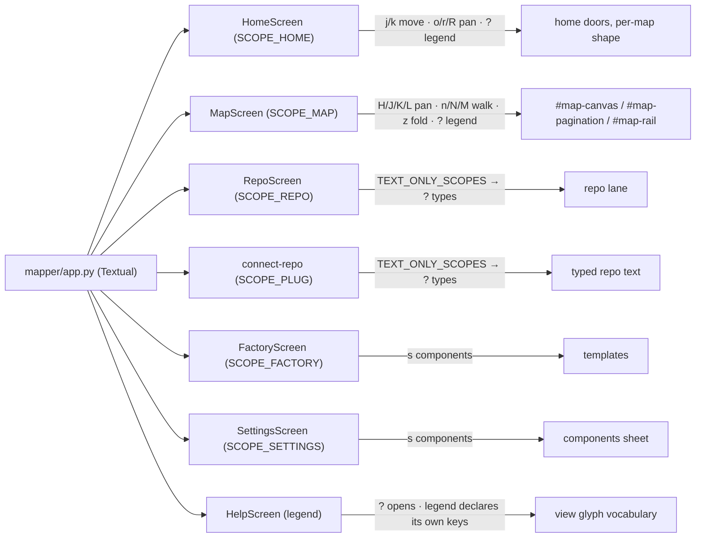

# Screen / key map — mapper — Batch 2026-08-26-ui-next-batch-02

> Phase 6 diagram. Every screen and `KEY_SCOPE` below is real at HEAD `46e190b`. Owner role: `docs-writer` — drafted by `deepseek-v4-pro`, verified by the orchestrator.

- The seat is `mapper/keymap.py::bindings_for` / `groups_for_keybar`; every screen declares a `KEY_SCOPE` (`mapper/screens/factory.py::FactoryScreen.KEY_SCOPE`, `mapper/screens/settings.py::SettingsScreen.KEY_SCOPE`).
- `?` is a legend chord everywhere **except** text-field scopes, where it is a typed character (`A-135`, `A-137`, `TEXT_ONLY_SCOPES`).
- `MapScreen` owns pan (`pan_x`/`pan_y` on `ViewState`, `mapper/views/state.py`), search walk (`_walk_hits`), and overflow declaration (`_declare_after_layout`).
