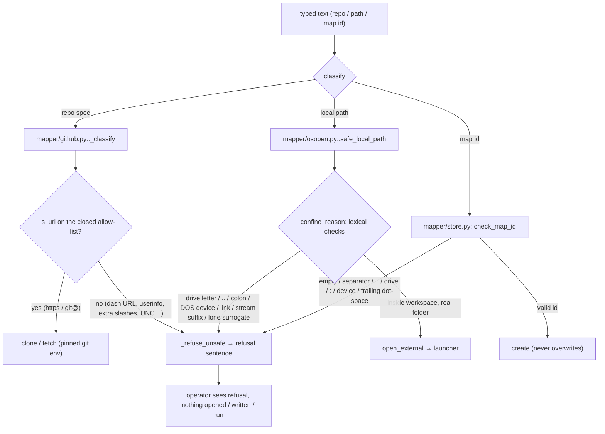

# Typed-input safety flow — mapper — Batch 2026-08-26-ui-next-batch-02

> Phase 6 diagram. Every node that names code names a real symbol at HEAD `46e190b` (grep-verified). Owner role: `docs-writer` — drafted by `deepseek-v4-pro`, verified by the orchestrator.

Two independent, closed allow-lists — one for URLs (`mapper/github.py`), one for paths (`mapper/osopen.py`) — plus a map-id confinement in the store. A refused input is refused **before any filesystem call or subprocess runs**; the refusal surfaces as a sentence (`refusal_sentence`) rather than a raw exception.
