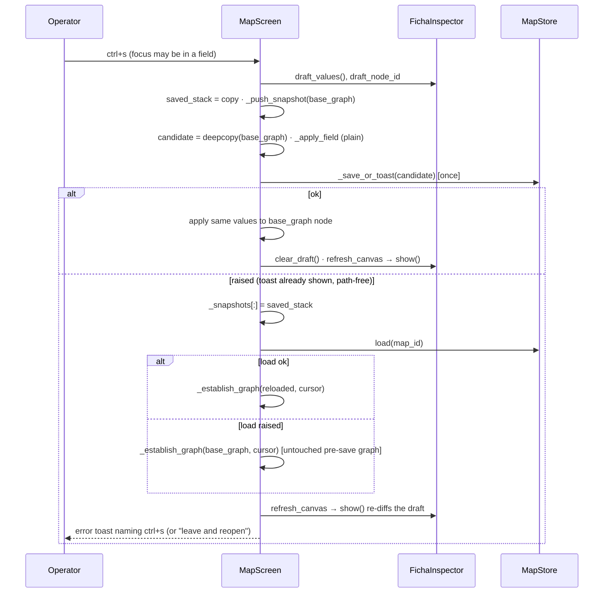

# Design proposal — mapper — Batch 2026-10-08-data-safety-batch

> **Artifact language.** Canonical **English scaffold**; generate in the batch's language
> The normative rules below are language-independent. **Where that language is declared:**
> `state.json`'s `language` key in `core` and `full`.

> **Reserved field names.** The **field names and block keywords below are language-independent** — the
> validator parses them literally and they are never translated:
> `Design proposal` · `7 · Forward-applicability table` · `⏸ DEFER`
> Everything else on this page — headings, guidance, the prose in every cell — is translated with the batch.

> **Owed in.** `core` by trigger · `full` ✓

> **Where this lives: the VAULT + Drive**, not the repo. It is **cited by id** from the repo
> (`PDR-2026-10-08-data-safety-batch#D<n>`), never copied. What binds code (the frozen interfaces in §4,
> the design characteristics in §2) also lands in the **repo**, in `01-requirements.md` (ledger entries)
> or in `docs/ARCHITECTURE.md` (§4 interface rows, §6 worksheet).

> **The forward-applicability rule (ISO/IEC/IEEE 15288).** Every section below names its consumer in §7.

| Field | Value |
|---|---|
| Id | `PDR-2026-10-08-data-safety-batch` |
| Requirements covered | US-001…US-004 · HLR-001…HLR-009 · 27 LLRs (LLR-001.1–001.4, 002.1–002.2, 003.1–003.6, 004.1–004.4, 005.1–005.2, 006.1–006.2, 007.1–007.2, 008.1–008.3, 009.1–009.2) · AT-001…AT-015 with AT-002a, AT-005a/b, AT-014a–d · cross-batch AT-025b, AT-033/034/035, AT-041, AT-042, AT-044 — all as approved in `01-requirements.md` (P2 round 4, ledger `.58`) |
| Modules touched (from `docs/ARCHITECTURE.md`) | `widgets` (`mapper/widgets/inspector.py`), `keymap` (`mapper/keymap.py`), `screens` (`mapper/screens/draft_guard.py` *new*, `mapper/screens/__init__.py`), `app` (`mapper/app.py`); tests and records only for US-002/003/004 |
| Triggers that fired | A2 · A3 · B1 · C6 · D1 · E1 · E2 (`PLAN.md` §Triggers) |
| Author / reviewers | `architect` (author) · `qa-reviewer` · `ux-reviewer` (D1) · `security-reviewer` lens over the write path and the guard title (C6, `01-requirements.md` §6.3) |

**Bottom line.** The design holds the ARQ map (R-012/R-013/R-014, no boundary move) and the approved
contract, with **one re-cut**: Inc-1 needs **5** source files, not 4, because the package convention
exports every screen through `mapper/screens/__init__.py` (`mapper/screens/__init__.py:4-11`,
imported as a package at `mapper/app.py:51`). Factoring the load path for LLR-004.2 stays inside
`app.py` and adds no file. The proposed cut is **Inc-1a** (guard modal + `draft` seat scope, 3 source
files) → **Inc-1b** (draft, `ctrl+s`, save/failure, node-change guard, 3 source files). This keeps R-014;
it does not reverse it as ARQ §7 pre-declared (see D1 and §6). The PDR also surfaces **one defect that
already exists** and the save design must not reproduce: today an inspector edit made while focus
(`f`) is active writes the **focused subtree as the whole map** (executed probe, §6 risk R-1).

---

## 1 · Objective and scope

**Objective (in the contract's terms).** Close the stray-write class of B-36 by construction: no write
of `.mmd`/`_nodos.yml` without `ctrl+s` or the guard's `save` (HLR-001), a visible unsaved state
(HLR-002), a `save · discard · stay` guard on every exit (HLR-003), one save = one whole-graph write +
one undo step, with failures reloading from disk and keeping what did not reach it (HLR-004), `↵` keeps
the draft (HLR-005), every field including `state` drafted (HLR-006). US-002/003 realise or reconcile
acceptance nodes (HLR-007/008). US-004 makes the own-keys test deterministic (HLR-009).

**What this design will NOT do.**
- No new module, no boundary move, no new dependency edge (ARQ D1–D3; `docs/ARCHITECTURE.md` §3 unchanged).
- No partial-write path in `MapStore` (LLR-004.4). `mapper/store.py` is not touched.
- No persistence of the draft (R1). A killed terminal loses it (A-11).
- No fix of the pre-existing `u`/focus defects found while designing (§6 R-6, R-7). They are routed, not folded.
- No product change for US-002/003/004.
- No fork. §8 is the declared empty.

## 2 · Modules and boundaries

| Module | What it owns here | What it exposes | What it must NOT reach into |
|---|---|---|---|
| `widgets` — `FichaInspector`, `FieldInput` | The one-node draft `{field: value}` holding only DIRTY entries; the dirty rule (vs `darkside.plain(stored)`, `STATE_VALUES[active]` for `state`); the draft overlay when rows are built; the per-field `●` marker and `● unsaved (N)` header painted in place | The frozen draft surface (§4 I-1); `FieldInput.node_id` (the node the input was built for) | `store`, `screens`, `app` (ban, `docs/ARCHITECTURE.md:123`); it never saves, never pushes the guard, never decides which exits ask |
| `keymap` | `SCOPE_DRAFT`, `GROUP_SCOPE["draft"]`, `GROUP_HEADER["draft"]`, `MODAL_SCOPES` widened, 3 `draft` rows, 1 map-scope `ctrl+s` row | Same seat API (`bindings_for`, `textual_bindings`, `hint_pair`) | Textual (the module stays Textual-free, `mapper/keymap.py:307-323`) |
| `screens` — `DraftGuardScreen` | The modal: title painted with `darkside.plain` at the sink and `markup=False`; the hint row read from the `draft` seat; dismissal tokens | `DraftGuardScreen(title: str, map_id: str = "") -> ModalScreen[str]` (map id added at Inc-1a for R9; packet `increment-002.md`) (§4 I-2) | `app` (ban, `docs/ARCHITECTURE.md:122`); imports `design` (`darkside`) and `keymap` only |
| `app` — `MapScreen`, `MapperApp` | `action_save_draft`; the save routine (copy-apply-write, one snapshot, failure reload); `_establish_graph` (the factored load path); `_guard_draft` (the one decision point for every exit); guards at `refresh_canvas`, the structural writes, `q`/`esc`, link-follow; the quit walk | Internal to `app` (§4 I-4, frozen across Inc-1b → Inc-2) | The draft's internals (reads only through I-1, plus the one declared test seam `_put_draft`) |

- Boundaries respected as declared in `docs/ARCHITECTURE.md`: ✓ — `widgets → {design, model, keymap}` and `screens → {design, keymap}` are existing edges (`docs/ARCHITECTURE.md:122-123`); `app → screens`, `app → widgets` exist. No new edge.

### 2.1 Design characteristics per increment (consumer: the Phase-3 increments)

Merit order, unchanged from ARQ §5 apart from the split: **Inc-3 → Inc-1a → Inc-1b → Inc-2 → Inc-4**.

#### Inc-1a — the guard modal and the `draft` seat scope (US-001; 3 source files)

| # | File · symbol | What is built | Properties (each one a check) |
|---|---|---|---|
| 1a.1 | `mapper/keymap.py` · `SCOPE_DRAFT`, `GROUP_SCOPE`, `GROUP_HEADER`, `MODAL_SCOPES`, `KEYMAP` | `SCOPE_DRAFT = "draft"` beside the other scopes (`:26-36`); `GROUP_SCOPE["draft"] = SCOPE_DRAFT` inserted after `"help"` (`:78`) so `bar_group_order` keeps `app` last; `GROUP_HEADER["draft"] = "unsaved"`; `MODAL_SCOPES = (SCOPE_PALETTE, SCOPE_HELP, SCOPE_DRAFT)` (`:269`); rows `KeyBinding("s", "s", "save", "save", "draft")`, `KeyBinding("d", "d", "discard", "discard", "draft")`, `KeyBinding("escape", "esc", "stay", "stay", "draft")` after the `help` rows (`:228-238`) | `bindings_for("draft")` = exactly 3 rows, no app chord (modal); `duplicate_chords() == []`; no `priority` |
| 1a.2 | `mapper/screens/draft_guard.py` *(new)* · `DraftGuardScreen(ModalScreen[str])` | `BINDINGS` generated from `textual_bindings(SCOPE_DRAFT)` (the `HelpScreen` pattern, `mapper/screens/help.py:221-224`); `action_save` / `action_discard` / `action_stay` → `self.dismiss("save" | "discard" | "stay")`; `compose` yields `Static(darkside.plain(self.title), id="draft-guard-title", markup=False)` and a hint row built from `bindings_for(SCOPE_DRAFT)` glyph+label; `DEFAULT_CSS` built from `darkside` tokens through an f-string | Exactly one of three tokens; title free of 0x1B and of live `[@click=…]` (`plain` strips controls, `mapper/darkside.py:550`; `markup=False` blocks markup, the `_ConfirmScreen` rule `mapper/app.py:383-404`); **no hex literal and no `darkside.WARN/ALERT/PULSE` in this file**, so the hue census (`tests/test_darkside_census.py:278-300`) does not move |
| 1a.3 | `mapper/screens/__init__.py` · import + `__all__` | `from mapper.screens.draft_guard import DraftGuardScreen`; add to `__all__` | Follows the convention every screen module follows (`:4-11`); this is the fifth file that forced the re-cut |

Inc-1a is green on its own: the modal exists, is bound from the seat, and is owned (`SCOPE_OWNER`), but nothing pushes it yet. That is an intermediate state inside one branch, never merged alone.

#### Inc-1b — draft, `ctrl+s`, save and failure, node-change guard (US-001; 3 source files)

| # | File · symbol | What is built | Properties |
|---|---|---|---|
| 1b.1 | `mapper/keymap.py` · `KEYMAP` | `KeyBinding("ctrl+s", "ctrl+s", "save_draft", "save", "node")` in the `node` group (`:172-177`) | Map seat 31 → 32 rows; the keybar and the legend gain `ctrl+s save` by derivation; not `priority` (the `Input` binds no `ctrl+s`, so it reaches the screen from a focused field — ARCH-B1, verified at P2) |
| 1b.2 | `mapper/widgets/inspector.py` · `FieldInput.__init__` | New keyword `node_id: str \| None = None`, stored on the instance; `_rows` passes `node_id=self.node.id` to every `FieldInput` it builds (`:143`, `:157-160`, `:166`) | Lets a stale `Input.Changed` be recognised without parsing the widget id (LLR-001.2) |
| 1b.3 | `inspector.py` · draft state + surface | `self._draft_node_id: str \| None`, `self._draft: dict[str, str]`; `draft_node_id` (property), `draft_values()` (returns `dict(self._draft)`), `has_draft()` (`bool(self._draft)`), `clear_draft()` (empties, repaints markers in place) | I-1, frozen (§4). Holds dirty entries only, so `has_draft()` ≡ "≥1 dirty field" and `N` = `len(draft)` |
| 1b.4 | `inspector.py` · `_field_of(widget)`, `_shown_value(field)`, `_put_draft(node_id, field, value)` | `_field_of` is the id→field mapping lifted out of `_commit` (`:357-364`). `_shown_value` returns `darkside.plain(stored)` for title/notes/schema keys and `STATE_VALUES[active]` for `state` (the `active` rule of `:138`). `_put_draft`: drop if `node_id != self.node.id` (stale); if `value == _shown_value(field)` remove the entry, else set it; set `_draft_node_id`; then `_paint_dirty()` | Cyclomatic complexity ≥ 3 → **Layer 0 applies** (TC-L0-1). `_put_draft` is also the **declared Layer-A test seam** for AT-013 |
| 1b.5 | `inspector.py` · handlers | **Add** `on_input_changed` → `event.stop()`; `_put_draft(event.input.node_id, field, event.value)`. **Replace** `on_input_submitted` (`:347-349`) with `event.stop(); event.input.action_leave_field()` — `↵` reuses the `esc` path (`FieldInput.Left` → `MapScreen.on_field_input_left`, `app.py:3390`). **Delete** `on_input_blurred` (`:351-352`) and `_commit` (`:354-365`). **Replace** the body of `on_ds_segmented_changed` (`:367-373`) with `_put_draft(self.node.id, "state", STATE_VALUES[event.index])` | Changed **in place**, no subclass: Textual 8.2.8 dispatches every `on_*` across the MRO (prototype `prototypes/b36_save/inapp.py:474-481`, risk A-8), so overriding would leave the base handler alive |
| 1b.6 | `inspector.py` · `FieldCommitted` | **Delete** the class (`:68-79`). The module docstring (`:3-6`, "posted as a message") is reworded | LLR-001.3: 0 hits of `FieldCommitted\|field_committed` under `mapper/` and `tests/` (A3, same increment as the consumer) |
| 1b.7 | `inspector.py` · `_rows`, `_header`, `_label`, `_paint_dirty` | `_rows` overlays the draft when `self.node.id == self._draft_node_id`: `FieldInput(value=draft.get(f, plain(stored)))`, `DsSegmented(active=…draft state…)`; keeps references to each label `Static` in `self._labels[field]` (no new key-derived widget ids, so the `F-A` id hazard, `tests/test_fold.py:640-660`, is not widened). `_header(ficha)` appends `"  ● unsaved (N)"` to the `card` line when N > 0. `_label(..., dirty=True)` appends `"  ●"`. Both styles come from ONE module constant `UNSAVED_STYLE = darkside.WARN`. `_paint_dirty()` calls `Static.update` on `#insp-header` and on each label — it never calls `show()`/`_rebuild` | LLR-002.2: the focused `Input` survives every keystroke. WARN is the token whose declared job is "pending" (`tests/test_darkside_census.py:443-460`); one constant = one new census site |
| 1b.8 | `inspector.py` · `show(node, graph)` | When `node.id == self._draft_node_id`, prune every entry now equal to `_shown_value` against the NEW `node` (the re-diff) before scheduling `_rebuild` | One rule serves LLR-004.2 (after a reload) and LLR-004.3 (after `u`): a value that reached disk turns clean by itself, the others stay. Values that stay are untouched |
| 1b.9 | `mapper/app.py` · `MapScreen._establish_graph(graph, *, cursor)` | Factored out of `on_mount` (`:1622-1636`): `base_graph = graph = graph`; `focus_active = False`; `_notice_load_warnings(graph)`; `nav = NavigationModel(graph)`; `nav.cursor = cursor if cursor in graph.nodes else graph.root_id`. `on_mount` calls it on both its branches (load success, and the error graph) with `cursor=None` (root); the session-resume block (`app.py:1638-1643`) and the error-branch `notify` stay in `on_mount`, after the call (PDR C3) | Behaviour-preserving for `on_mount` (its existing load-warning and error-graph tests are the regression guard); the reload path calls the SAME function — "exactly as the screen's own load path does" by construction, not by imitation |
| 1b.10 | `app.py` · `MapScreen._apply_field(ficha, field, value)` (static) | The write-side twin of `_ficha_value` (`:3381`): `value = darkside.plain(value)` (A-111), then title / notes / state / `fields[key]` | Crosses the `widgets → app` boundary and coerces → **Layer 0 applies** (TC-L0-2) |
| 1b.11 | `app.py` · `MapScreen._save_draft() -> bool` and `action_save_draft()` | See the algorithm below; `action_save_draft` = `self._save_draft()` | The ONE save routine; Inc-2 reuses it from the guard |
| 1b.12 | `app.py` · `MapScreen._push_snapshot(graph=None)` | Optional argument; defaults to `self.graph` (every existing caller unchanged); the save passes `self.base_graph` | Under focus the snapshot is of the whole map, not the subtree (R-1) |
| 1b.13 | `app.py` · `MapScreen._guard_draft(proceed, *, on_hold=None)` + `self._draft_guard_open` | No draft → `proceed()` now. Guard already open → return (no second modal). Else push `DraftGuardScreen(title)` with title per R9: `DraftGuardScreen(plain(node title as stored), map_id)` renders `unsaved draft on «{title}» · {map_id}`; callback: `save` → `if self._save_draft(): proceed() else: on_hold()`; `discard` → `inspector.clear_draft(); proceed()`; `stay` → `on_hold()`. `_draft_guard_open` is cleared in the callback before `proceed` runs | The one decision point R-014 names; LLR-004.2 "no second guard while one is held at `stay`"; LLR-003.5 non-re-entrant |
| 1b.14 | `app.py` · `MapScreen.refresh_canvas` (`:3232`) | **First statements**: (a) `_drop_orphan_draft()` — a draft whose node is not in `self.base_graph` is cleared with a warning toast naming its fields (`darkside.plain`, `markup=False`); (b) if `has_draft()` and `nav.cursor != draft_node_id`: `target = nav.cursor`; `nav.cursor = draft_node_id`; `inspector.focus_after_rebuild(None)`; `_guard_draft(lambda: self._repoint(target))`; then continue painting the draft node | Guarded **before** the canvas, crumb, rail and inspector repaint, so `stay` needs no repaint and the inspector is never re-pointed under a draft (LLR-003.2, A-9). Every cursor mover is covered because they all end in `refresh_canvas` |
| 1b.14a | `app.py` · `MapScreen._repoint(target)` | Re-checks `target in self.graph.nodes` (else `self.graph.root_id`), sets `nav.cursor = target`, calls `refresh_canvas()` | The single re-point after a guard answers `save`/`discard`; never called with a draft pending for another node (PDR C2) |
| 1b.15 | `app.py` · `on_ficha_inspector_field_committed` (`:3344-3378`) | **Deleted**, with its docstring | LLR-001.3 |
| 1b.16 | `app.py` · the fill-in hint (`:4040-4043`) | `f"fill in «{label}» · {self._seat_glyph('save_draft')} {self._seat_label('save_draft')} · esc leave field"`, key = the seat glyph; the comment at `:4040-4042` rewritten | LLR-005.2; no chord literal, so `tests/test_keymap.py:298-336` (M-1) keeps scanning nothing new |

**The save routine (`_save_draft`, 1b.11).**

1. `draft = inspector.draft_values()`; `nid = inspector.draft_node_id`. Empty → return `True` (no write, no snapshot).
2. `saved_stack = list(self._snapshots)`; `self._push_snapshot(self.base_graph)` — once, before applying (LLR-004.1).
3. `candidate = copy.deepcopy(self.base_graph)`; `_apply_field(candidate.nodes[nid].ficha, f, v)` for each entry.
4. `ok = _save_or_toast(self, self.store, self.map_id, candidate)` — once (LLR-001.4). It stays the guarded call site the census requires (`tests/test_g6_store_surrogates.py:509-540`) and keeps its path-free toast (`app.py:229-264`).
5. **Success:** apply the same entries to `self.base_graph.nodes[nid].ficha`. The `Node` objects are shared with a focus subgraph (`mapper/model.py:207-213`), so the focused view sees them too. Then `inspector.clear_draft()`; `refresh_canvas()`; `_event_toast("saved", …)`; return `True`.
6. **Failure:** `self._snapshots[:] = saved_stack`. This restores the undo stack exactly, including an entry `_push_snapshot` evicted at `UNDO_DEPTH` (`app.py:3514-3515`); a bare `pop()` would lose it. Then `cursor = nav.cursor`; `try: graph = self.store.load(self.map_id)` → `_establish_graph(graph, cursor=cursor)`; `except Exception:` → `_establish_graph(self.base_graph, cursor=cursor)`, which restores the pre-save graph. It needs no store call and is a true restore because step 3 never mutated `base_graph`. Then `refresh_canvas()`, which runs the orphan drop and the re-diff of 1b.8 and 1b.14. Then one notify: `"draft kept · {ctrl+s glyph} to retry"`, or on a reload failure `"could not reload — leave and reopen the map"`, both `severity="error"`, `markup=False`. Return `False`. **No `.mmd`/`_nodos.yml` write anywhere on this path.** The reload's `_reindex` (`store.py:783`) is the declared cache refresh.

Why copy-apply-write rather than mutate-then-restore: the in-memory graph cannot hold an unsaved value at any instant. That closes A-10 by construction, and the "restore the pre-save graph" arm becomes a no-op instead of a reconstruction. Cost: one `deepcopy` of the graph per `ctrl+s`. It is not measured; it is expected to be negligible for maps of hundreds of nodes (estimate, `planned` to time at Inc-1b).

#### Inc-2 — every other exit (US-001; 1 source file: `mapper/app.py`)

| # | Symbol | What is built |
|---|---|---|
| 2.1 | `MapScreen.action_home` (`:4683-4684`), pop branch of `action_back_or_home` (`:4719`) | `self._guard_draft(self.app.pop_screen)` — the palette dispatches the same methods (`:4920-4927`), so it is covered too (LLR-003.3) |
| 2.2 | `MapScreen.action_open_ficha` (`:3559-3567`) | The `linked` branch becomes `self._guard_draft(lambda: self.app.push_screen(MapScreen(linked, …)))`; the non-link `_FichaScreen` push is not an exit (ARQ D3) and stays unguarded (LLR-003.4, R6) |
| 2.3 | `MapperApp.action_quit` (`:4937-4938`) + `self._quit_walk_open` | Re-entry → return. Else `pending = [s for s in reversed(self.screen_stack) if isinstance(s, MapScreen) and s.has_pending_draft()]`; guard each in turn through its own `_guard_draft(proceed=next step, on_hold=end the walk)`; the last step calls `self.exit()`. `MapScreen.has_pending_draft()` is a one-line delegate to the inspector (LLR-003.5) |
| 2.4 | `action_add_child` (`:4545`), `action_archive` (`:4592`), `on_ficha_inspector_attachment_add_requested` (`:3436`), `on_ficha_inspector_attachment_remove_requested` (`:3468`) | The existing bodies move into `_add_child()`, `_archive()`, `_add_attachment(node_id)`, `_remove_attachment(node_id, index)`; each entry point becomes `self._guard_draft(lambda: …)`. The attachment guards sit in the MESSAGE handlers, which already carry `node_id`/`index`, not in `action_*`, because a `save` answer rebuilds the inspector and destroys the focused chip that `request_remove_attachment` reads (`inspector.py:333-345`). Every continuation re-resolves its node by id (LLR-003.6) |

Between Inc-1b and Inc-2, `q`/`esc`/link/quit/structural writes run unguarded. The worst outcome is a **lost unsaved draft, never a write**, because the draft is not in `self.graph`. The branch is merged only after Inc-2.

#### Inc-3 — FLAKE-2 deflake (US-004; 0 source files)

| # | File · site | What is built |
|---|---|---|
| 3.1 | `tests/test_help_scope.py:365`, `:93`; `tests/test_en7.py:246`; `tests/test_repair_layout.py:118` | `immediate=True`, then a settle assertion before sampling: `target` is computed before the call, and `assert pane.scroll_offset.y == min(target, pane.max_scroll_y)` follows it (`:93`/`:118` page by a computed step; `:246` and `:365` go to fixed targets) |
| 3.2 | `tests/test_help_scope.py` · `_effective_keys(app, pilot, screen)` helper | The loop body of `test_hlr_n16_4_legend_declares_its_own_keys` (`:357-373`) is lifted into a helper that both the existing node and the new regression arm call. A revert of `immediate=True` therefore reddens the arm, because the arm runs the same code and not a copy of it |
| 3.3 | `tests/test_help_scope.py` · fixture `delay_deferred_scroll` + flag | Adapted from `spike/red_green_flake2.py:18-27`: `Widget.call_after_refresh` is monkeypatched to route only `_scroll_to`, and only while a module flag is set around the test's own positioning call, through `set_timer(0.15, …)` |

#### Inc-4 — AT-044 node and the reconciliations (US-002, US-003; 0 source files)

| # | File | What is built |
|---|---|---|
| 4.1 | `tests/test_double_question_mark.py` *(new)* | AT-044 node (LLR-007.1) |
| 4.2 | `tests/test_repair_layout.py:440-453` | `test_tc_r25` parametrised `[SCOPE_MAP, SCOPE_HOME, SCOPE_APP]` plus a sibling `test_tc_r25b_…` that builds `HelpScreen()` with no scope argument (`mapper/screens/help.py:286-288`) — LLR-008.3. `_rendered_pairs` takes an optional ready-made screen |
| 4.3 | `01-requirements-ledger.md`, `.dev-flow/BACKLOG.md`, the Atlas | AT-025b → `tests/test_repair_cycles.py:501,543,575,624,664`; AT-041 → `tests/test_repair_layout.py:274`; AT-042 largest-set → `:441`; AT-033/034/035 retired to US-N14 (`#D23`) — LLR-007.2, 008.1, 008.2 |

### 2.2 Enablers (consumer: Phase 3 and validation)

| Id | Enabler | Built in | Used by |
|---|---|---|---|
| E-1 | **Pilot helpers** in `tests/test_draft_save.py`: `_seed_map(app, …)` (a 3-node map with one schema field, title/notes/state seeded, written through `app.store.save`, the `tests/test_inspector.py:24-41` pattern); `_open(app, pilot, map_id, cursor)` (the `:44-51` pattern); `_hashes(tmp_path, map_id) -> tuple[str, str]` (sha256 of `.mmd` and `_nodos.yml`, the §5.1 `obs`); `_type_into(pilot, screen, field_id, text)` (focus + real `pilot.press` per character); `_leave_field(pilot)` (`escape`); `_answer(pilot, key)` (asserts `isinstance(app.screen, DraftGuardScreen)` first, then presses) | Inc-1a (modal-only helpers), Inc-1b (the rest) | every US-001 AT and integration TC |
| E-2 | **Fault-injection seam (AT-002a, LLR-004.2)**: `_failing_save(screen, *, after)` replaces `screen.store.save` with a function that raises `OSError("boom")` either **before** writing (`after="zero"`) or **after** calling the real bound `save` (`after="both"`), and returns the real one for restore. The `screen.store.save = …` precedent is `tests/test_g6_store_surrogates.py:240`. The reload-raises arm also replaces `screen.store.load` with a raiser. All three are declared Layer-A seams, never a posted message | Inc-1b | AT-002a, TC-004.2-* |
| E-3 | **Draft-injection seam (AT-013)**: `screen.query_one("#map-inspector", FichaInspector)._put_draft(node_id, field, value)` on the LOWER `MapScreen`. It is the same mutator the real handlers call, so the injected draft is indistinguishable from a typed one | Inc-2 | AT-013 |
| E-4 | **Injected-delay fixture** `delay_deferred_scroll` + `_effective_keys` helper (2.1 · 3.2–3.3) | Inc-3 | AT-008, LLR-009.2 |
| E-5 | **Hostile-title payloads**: `"\x1b[2J"` (ESC), `"[@click=screen.save]x[/]"`, a lone surrogate `"\ud800"` | Inc-1a (unit), Inc-1b (AT-015) | LLR-003.1, AT-015 |
| E-6 | **Message tap** for LLR-001.2: an `App` subclass is NOT used (MRO dispatch, A-8); the test reads `screen.store.save` call count and the hash pair, and asserts no posted message type reaches `MapScreen` except `FieldInput.Left`, by wrapping `MapScreen.post_message` for the scenario. It never spells the removed class name (LLR-001.3's grep scope includes `tests/`) | Inc-1b | LLR-001.2 |
| E-7 | **Seat-diff census** `tests/test_data_safety_census.py` *(new)*: `DATA_SAFETY_ADDED = {("draft","s","save"), ("draft","d","discard"), ("draft","escape","stay"), ("map","ctrl+s","save_draft")}` — the projection the older live-reading census nodes subtract (§5.3) | Inc-1a (3 rows), Inc-1b (4th row) | §5.3 regression edits |
| E-8 | **Staging step**: every NEW source or test file is `git add`-ed before the gate run, because `tests/test_a3_census.py:40-58` and `tests/test_darkside_census.py:87-104` derive their input from the tracked tree. This is a process step with no code | each increment that adds a file | the gate run |

## 3 · Diagrams

Two viewpoints apply: **State dynamics** (the draft) and **Interaction** (the save and its failure).
Logical/structure viewpoints add nothing to ARQ's module map, so they are not drawn.

**State dynamics — one inspector's draft**

```mermaid
stateDiagram-v2
    [*] --> Clean
    Clean --> Dirty: Input.Changed / segment change\nvalue != shown
    Dirty --> Clean: edit back to shown value
    Dirty --> Dirty: further keystrokes (markers repaint in place)
    Dirty --> Guarded: cursor moves · q/esc · link · ctrl+q · a/x/A/X
    Guarded --> Dirty: stay (cursor restored, exit aborted)
    Guarded --> Clean: discard (exit proceeds)
    Guarded --> Saving: save
    Dirty --> Saving: ctrl+s
    Saving --> Clean: write ok (draft cleared, exit proceeds if guarded)
    Saving --> Dirty: write failed → reload from disk → re-diff\n(entries that reached disk turn clean; guard held at stay)
    Dirty --> Clean: draft node gone after reload/undo\n(dropped with a warning)
```

**Interaction — `ctrl+s`**

## 4 · Interfaces that change — and which ones FREEZE

There is no fork, so "frozen" here means **frozen across increments**: Inc-2 and Inc-4 consume these without changing them. A change after PDR is trigger A3 and re-opens this PDR.

| Interface | Current | After | Consumers | **Frozen for the fork?** |
|---|---|---|---|---|
| I-1 `FichaInspector` draft surface | absent (`grep -rn "draft_values\|has_draft\|clear_draft" mapper/widgets/inspector.py` → 0, contract LLR-001.1) | `draft_node_id -> str \| None` · `draft_values() -> dict[str, str]` (copy; keys = schema keys or `title`/`notes`/`state`; dirty entries only) · `has_draft() -> bool` · `clear_draft() -> None`; test seam `_put_draft(node_id, field, value)` (Layer-A only) | `MapScreen` (Inc-1b, Inc-2), `MapperApp` via `MapScreen.has_pending_draft()` (Inc-2), tests | **Frozen at PDR seal** (n/a for a fork — single lane) |
| I-2 `DraftGuardScreen` | absent | `DraftGuardScreen(title: str, map_id: str = "") -> ModalScreen[str]` (map id added at Inc-1a for R9; packet `increment-002.md`), dismissed with exactly `"save"` · `"discard"` · `"stay"`; keys from `SCOPE_DRAFT`; the sink applies `darkside.plain` + `markup=False` | `MapScreen._guard_draft` (Inc-1b, Inc-2) | **Frozen** (matches `docs/ARCHITECTURE.md:180`) |
| I-3 `KEYMAP` seat | 75-row seat; map scope 31 rows; `MODAL_SCOPES = (palette, help)` (`keymap.py:137-269`) | + `SCOPE_DRAFT`, `GROUP_SCOPE["draft"]`, `GROUP_HEADER["draft"]`, `MODAL_SCOPES` + `draft`, 3 `draft` rows (Inc-1a), 1 map `ctrl+s → save_draft` row (Inc-1b) | keybar, legend, palette, every `BINDINGS` generated from the seat; the pins in §5.3 | **Frozen after Inc-1b** |
| I-4 `MapScreen` internals | `on_ficha_inspector_field_committed`, `_push_snapshot()` | `action_save_draft`, `_save_draft() -> bool`, `_guard_draft(proceed, *, on_hold=None)`, `_establish_graph(graph, *, cursor)`, `_repoint(target)`, `_apply_field`, `_push_snapshot(graph=None)`, `has_pending_draft()` | Inc-2 (all of them), tests | **Frozen across Inc-1b → Inc-2** |
| I-5 `FichaInspector.FieldCommitted` + its handler | present (`inspector.py:68`, `app.py:3344`) | **removed** (A3), same increment as the consumer | 3 test files re-pointed (§5.3) | n/a — deleted |
| I-6 `FieldInput` constructor | `FieldInput(*args, **kwargs)` (`inspector.py:54-56`) | + `node_id: str \| None = None` keyword | `FichaInspector._rows` only | Frozen after Inc-1b |
| `MapStore.save` / `MapStore.load` | `save(map_id, graph)` `store.py:809`; `load(map_id)` | **unchanged** | — | Frozen (not touched; LLR-004.4) |

**A frozen interface is not touched inside a lane.** If a later increment must change one, the work returns to the trunk (trigger A3).

## 5 · Proposed test cases

The layers are **0** (unit, by the CC≥3 or boundary criterion), **A** (white-box TC over an LLR), **B** (black-box AT through keys, screens and files; `obs` = `App.run_test` pilot + sha256 pair, §5.1 of the contract), and **UX**. "RED today" means the arm fails on the base tree, i.e. the C-40 counterfactual. The **mutation** column names the edit that turns the committed node RED **after** the fix lands. Every mutation is a one-site edit of the shipped code, executed and restored with a hash check at the increment (`templates/docs/increment-template.md` §Mutation verdicts).

**File key.** DS = `tests/test_draft_save.py` *(new)* · IN = `tests/test_inspector.py` · HS = `tests/test_help_scope.py` · RL = `tests/test_repair_layout.py` · DQ = `tests/test_double_question_mark.py` *(new)* · CS = `tests/test_data_safety_census.py` *(new)*.

### 5.1 US-001 (Inc-1a / Inc-1b / Inc-2)

| Id | Layer | Planned node | Inc | What it asserts | **The mutation that turns it RED** |
|---|---|---|---|---|---|
| AT-001 | B | `DS::test_at_001_a_stray_key_then_blur_and_cursor_change_writes_nothing` | 1b | focus title, press `n`, `esc`, `j` → guard up → `esc` (stay): hash pair identical to the start, the title label carries `●`, cursor unchanged | re-add a blur→save path (`FichaInspector.on_input_blurred` calling into the save); RED today (blur writes, `inspector.py:351`) |
| AT-002 | B | `DS::test_at_002_ctrl_s_writes_once_and_u_restores_the_pre_save_state` | 1b | after an edit the pair is unchanged; `ctrl+s` changes it exactly once; `esc`, `u` → pair equals the pre-save pair | push the snapshot AFTER `_apply_field` on `base_graph` (undo restores the saved state) / call `_save_or_toast` twice (pair changes twice); RED today (`ctrl+s` unbound) |
| AT-002a | A (declared seam E-2) | `DS::test_at_002a_failed_save_reloads_from_disk[zero_files]`, `[both_files]` | 1b | two fields drafted, `ctrl+s` against the raising store: zero → pair identical, both fields `●`, `● unsaved (2)`; both → pair = the edit, draft empty, no `●`; both arms: pair changed ≤1 time, `len(app.undo_stacks[map_id])` = pre-save length | zero arm: "clear the draft on any failure"; both arm: "skip the reload, keep `base_graph`" (fields stay dirty vs the stale stored value) |
| AT-003 | B | `DS::test_at_003_header_counts_unsaved_fields_and_marks_each` | 1b | edit field 1 → header `● unsaved (1)` + `●` on its label; edit field 2 → `(2)`; edit field 1 back → `(1)` | count `N = 1 if draft else 0` / skip `_paint_dirty` on Changed; RED today (no count, `inspector.py:202-207`) |
| AT-004 | B | `DS::test_at_004_node_change_with_a_draft_presents_the_guard[save,discard,stay]` | 1b | `esc` then `j`: guard once; `s` → pair written once + cursor moved; `d` → pair unchanged + cursor moved + no `●`; `esc` → cursor unchanged + draft kept | "`stay` re-points anyway" (`on_hold` calls `_repoint(target)`) |
| AT-005a | B | `DS::test_at_005a_leave_with_q_is_guarded[save,discard,stay]` | 2 | `q` with a draft: guard once; `s`/`d` → `len(app.screen_stack)` −1; `esc` → depth unchanged | "`stay` falls through" (`on_hold` = `pop_screen`) |
| AT-005b | B | `DS::test_at_005b_leave_with_esc_is_guarded[save,discard,stay]` | 2 | as 005a with `esc` (no live search) | same mutation on the `action_back_or_home` pop branch |
| AT-006 | B | `DS::test_at_006_enter_keeps_the_draft_leaves_the_field_and_the_hint_names_ctrl_s` | 1b | type, `↵`: pair unchanged, `app.focused` is not the field, `●` kept; on a node with a missing required field the hint contains the seat's `save_draft` glyph+label and not `↵ save` | `on_input_submitted` calls `_save_draft` / restore the `↵ save` literal; RED today (`inspector.py:347-349`, `app.py:4043`) |
| AT-007 | B | `DS::test_at_007_state_segment_routes_through_the_draft` | 1b | focus `#insp-state`, `right`: pair unchanged, state label `●`; `ctrl+s` → disk state = `STATE_VALUES[1]` | segment change saves immediately; RED today (`inspector.py:367-373`) |
| AT-009 | B | `DS::test_at_009_undo_leaves_the_draft_and_recomputes_the_markers` | 1b | title A→B and notes n→m, `ctrl+s`; title B→A, notes m→p, `esc`, `u` → disk = (A, n); header `● unsaved (1)` (title clean vs restored A, notes `p` dirty); notes field value still `p` | "markers not recomputed after `u`" (skip the prune in `show()`, 1b.8) → `(2)` — see open question Q-3 |
| AT-010 | B | `DS::test_at_010_ctrl_s_inside_the_field_saves_the_typed_text` | 1b | type `xyz` in the title, `ctrl+s` with focus still in the field → both files carry `xyz` | update the draft on blur/submit only (drop `on_input_changed`) |
| AT-011 | B | `DS::test_at_011_following_a_link_is_guarded[save,discard,stay]` | 2 | on a node linking to another map: `↵` with a draft → guard before the push; `s`/`d` depth +1; `esc` depth unchanged | "push before the guard answers" |
| AT-012 | B | `DS::test_at_012_quit_is_guarded[save,discard,stay]` | 2 | `ctrl+q` with a draft → guard; `s`/`d` → `app.is_running` false; `esc` → true | "quit proceeds on `stay`" (`on_hold` = `exit`) |
| AT-013 | A (seam E-3) | `DS::test_at_013_quit_walks_a_lower_map_screen_draft` | 2 | two map screens, draft injected on the lower one, `ctrl+q` → a guard whose title names the lower map; `esc` → running | walk `[self.screen]` only instead of `screen_stack` |
| AT-014a–d | B | `DS::test_at_014_structural_write_opens_the_guard_first[a,x,A,X]` | 2 | `esc` then `a` / `x` / `A` / `X` (chip focused for `X`): guard is up and pair unchanged **before** any answer; `d` then completing the write → files do not contain the draft value; `esc` → no prompt, pair unchanged | "guard opened after the write" (call `_add_child()` etc. first, guard second) |
| AT-015 | B | `DS::test_at_015_guard_title_carries_no_escape_byte` | 1b | node title `"t\x1b[2Jx"` and title `"[@click=screen.save]x[/]"`: open the guard via `j`; scan the rendered `#draft-guard-title` for 0x1B → none; markup text literal | drop `darkside.plain` at the sink (`markup=False` alone passes ESC, `textual/content.py:56-62`) |
| TC-001.1 | 0 | `IN::test_llr_001_1_draft_surface_is_a_copy_and_clears` | 1b | `draft_values()` mutation does not change `has_draft()`; `clear_draft()` → `has_draft()` false, `draft_node_id` None | return `self._draft` (not a copy) / `clear_draft` no-op |
| TC-001.2a | A | `IN::test_llr_001_2_draft_updates_on_every_keystroke_and_posts_no_save` | 1b | after each `pilot.press`, `draft_values()[field]` equals the text so far; blur and `↵` cause 0 `store.save` calls and no message other than `FieldInput.Left` (E-6) | update the draft in `on_input_submitted`/blur only |
| TC-001.2b | 0 | `IN::test_llr_001_2_a_stale_change_from_a_re_pointed_input_is_dropped` | 1b | post `Input.Changed(old_input, "zz")` after `show()` re-pointed to another node → `has_draft()` false | key the entry to `self.node.id` instead of `event.input.node_id` |
| TC-001.3 | inspection | packet evidence: `grep -rn "FieldCommitted\|field_committed" --include=*.py mapper tests` → 0 | 1b | absence (17 lines today) | n/a — inspection; **constraint on authors:** no new test or docstring may spell either name |
| TC-001.4 | A | `DS::test_llr_001_4_one_ctrl_s_is_one_store_save` | 1b | a counting wrapper over `screen.store.save`: 3-field draft, `ctrl+s` → 1 call; `ctrl+s` with no draft → 0 | a loop calling `_save_or_toast` per field |
| TC-002.1 | 0 | `IN::test_llr_002_1_dirty_is_against_the_shown_value[plain_alters_title,unknown_state]` | 1b | a stored title with a control char (which `plain` alters) opens clean; a stored state `"weird"` shows `ok`, and moving right then left leaves it clean | compare against the raw stored value / against `ficha.state` |
| TC-002.2 | A | `IN::test_llr_002_2_markers_update_without_remounting_the_focused_field` | 1b | `field = app.focused`; 3 keystrokes → `app.focused is field` and the header count is live | call `self.show(self.node, …)` from `_put_draft` (remount) |
| TC-003.1 | 0 | `DS::test_llr_003_1_modal_returns_the_token_for_each_key[s,d,escape]` + `DS::test_llr_003_1_modal_title_is_literal_and_plain` | 1a | hosted in a minimal `App`; each key → its token; payloads E-5 render literally, no 0x1B | swap the `d` row's action to `stay` in the seat / `markup=True` / drop `plain` |
| TC-003.2 | A | `DS::test_llr_003_2_node_change_guard_holds_the_inspector_on_the_draft_node` | 1b | while the guard is up, `#insp-title` still shows the draft node's draft value and `nav.cursor == draft_node_id` | move the guard check after the inspector `show()` call (`app.py:3281`) |
| TC-003.5 | A | `DS::test_llr_003_5_a_second_ctrl_q_stacks_no_second_guard` | 2 | guard up, `ctrl+q` again → exactly one `DraftGuardScreen` on the stack | drop the `_quit_walk_open` check |
| TC-004.1 | A | `DS::test_llr_004_1_one_snapshot_and_one_write_per_multi_field_save` | 1b | 2-field draft, `ctrl+s` → undo stack +1, one save call | a `_push_snapshot()` per field; RED today (per-commit snapshot, `app.py:3362`) |
| TC-004.2a | A (E-2) | `DS::test_llr_004_2_failure_restores_the_undo_stack_exactly_at_depth` | 1b | stack pre-filled to `UNDO_DEPTH` (20) distinct blobs; failed save → stack list equal (content and order) to before | `self._snapshots.pop()` instead of the slice restore (the evicted oldest blob is lost) |
| TC-004.2b | A (E-2) | `DS::test_llr_004_2_reload_raises_restores_the_pre_save_graph_without_a_write` | 1b | save and load both raise: pair unchanged, `base_graph` node equals pre-save values, draft kept, toast says "leave and reopen" | apply to `base_graph` before the save (mutate-then-save) |
| TC-004.2c | A (E-2) | `DS::test_llr_004_2_a_draft_on_a_vanished_node_is_dropped_with_a_warning` | 1b | `both_files` arm whose real save is followed by an external rewrite of the map without the node → draft empty; warning names the field; cursor at root; no guard on the stack | skip `_drop_orphan_draft` (a guard opens for a node that no longer exists) |
| TC-004.2d | A (E-2) | `DS::test_llr_004_2_failure_clears_focus_and_rebuilds_nav` | 1b | `f` on a node, edit, failing `ctrl+s` → `focus_active` false, `nav.graph is screen.graph` | reload by assigning `self.graph` only (skip `_establish_graph`) |
| TC-004.3 | A | `DS::test_llr_004_3_undo_with_an_empty_stack_keeps_the_draft` | 1b | draft pending, `esc`, `u` on an empty stack → "nothing to undo", draft and markers intact | `clear_draft()` inside `action_undo` |
| TC-004.4 | A (proposed, needs ledger — Q-1) | `DS::test_llr_004_4_ctrl_s_under_focus_writes_the_whole_map` | 1b | `f` on a child, edit, `ctrl+s` → reloaded map still has every node; `u` restores the whole map | save `self.graph` (the subgraph): **this is today's behaviour of the commit path, executed** (§6 R-1) |
| TC-005.1 | A | `IN::test_llr_005_1_enter_leaves_the_field_and_keeps_the_draft` | 1b | `↵` → focus not on the field, draft unchanged, 0 saves | `on_input_submitted` does not call `action_leave_field` / clears the draft |
| TC-005.2 | A | `DS::test_llr_005_2_fill_in_hint_reads_the_save_glyph_from_the_seat` | 1b | hint text contains `f"{row.glyph} {row.label}"` of the `save_draft` row from `bindings_for(SCOPE_MAP)` | keep the literal; RED today (`↵ save`, `app.py:4043`) |
| TC-006.1 | A | `IN::test_llr_006_1_state_change_updates_the_draft_and_writes_nothing` | 1b | segment `right` → `draft_values()["state"] == "risk"`, 0 saves | post a save from `on_ds_segmented_changed` |
| TC-006.2 | A (cheap aid to an inspection LLR) | `IN::test_llr_006_2_every_editable_surface_has_a_draft_key[title,notes,D,state]` | 1b | editing each surface yields its key in `draft_values()` | drop the `notes` arm of `_field_of` |
| TC-L0-1 | 0 | `IN::test_layer0_put_draft_branches[stale,equal_to_shown,set]` | 1b | the three branches of `_put_draft` | invert the `==` prune test |
| TC-L0-2 | 0 | `DS::test_layer0_apply_field_coerces_and_routes[title,notes,state,schema]` | 1b | a lone surrogate is coerced; each key lands on its attribute | drop `plain` / swap the notes and title branches |
| UX-1 | UX | `ux-reviewer` walkthrough at the Inc-1b gate (renders at 118 and 87 columns: header, `●`, guard, keybar `ctrl+s save`) | 1b | the D1 lens over the visible deltas the prototype verdict did not render (keybar row, guard copy, focus after `ctrl+s`) | n/a — review, not a node |

### 5.2 US-002 / US-003 / US-004

| Id | Layer | Planned node | Inc | What it asserts | **The mutation that turns it RED** |
|---|---|---|---|---|---|
| AT-044 / TC-007.1 | B | `DQ::test_at_044_a_doubled_question_mark_opens_one_legend` | 4 | `?`, `?` from a map → `len(app.screen_stack)` unchanged after the second press and `isinstance(app.screen, HelpScreen)` | drop `SCOPE_HELP` from `MODAL_SCOPES` (`keymap.py:269`): the legend inherits the app `?` chord |
| AT-025b / LLR-007.2 | inspection | Atlas + ledger mapping to `tests/test_repair_cycles.py:501,543,575,624,664` | 4 | resolves to ≥1 node | n/a — reconciliation (no RED side, declared in the contract) |
| AT-041, AT-042 largest set / LLR-008.1 | inspection | `RL:274`, `RL:441` | 4 | resolve | n/a |
| AT-042 smallest set / LLR-008.3 | A | `RL::test_tc_r25_the_presented_set_equals_the_keymap_set_in_both_directions[app]` | 4 | 2 rows, set equality both ways | make `_rendered_pairs` / the panel render a constant `SCOPE_MAP` regardless of the argument |
| AT-042 no-scope / LLR-008.3 | A | `RL::test_tc_r25b_a_screen_declaring_no_scope_presents_the_app_set` | 4 | `HelpScreen()` → `bindings_for(SCOPE_APP)` pairs | change the `HelpScreen` default `scope=SCOPE_APP` (`help.py:288`) to `SCOPE_MAP` |
| AT-033/034/035 / LLR-008.2 | inspection | ledger retirement | 4 | no obligation in this batch's Atlas | n/a |
| AT-008 / TC-009.2 | A (test-instrument) | `HS::test_at_008_the_own_keys_loop_is_deterministic_under_a_late_scroll` (fixture E-4) | 3 | `effective == painted` with the positioning `_scroll_to` delayed 150 ms | drop `immediate=True` from `_effective_keys`; the executed counterfactual is `spike/red_green_flake2.py`, 2/2 RED |
| TC-009.1 | A | the four settle assertions + `HS::test_hlr_n16_4_settle_assertion_fails_loud_when_the_scroll_never_lands` | 3 | monkeypatched no-op `Widget._scroll_to` → `pytest.raises(AssertionError)` from `_effective_keys` | delete the settle assertion (the arm then passes silently and its `raises` fails) |

### 5.3 Inc-1 regression obligations — every existing test the change reddens, with the planned edit

The contract's §5 list is (a)–(d). Rows marked **NEW** were found by this PDR's census and are not in the contract. Predictions are `planned` until the Inc-1b file-level RED census executes them in one complete run (C-19) over the files named here.

| Obligation | Site | Inc | Predicted | Planned edit |
|---|---|---|---|---|
| (a) | `tests/test_inspector.py:54-81` `test_at_n01a…` (type + `enter`, `:75`) | 1b | RED (`↵` no longer writes) | `enter` → `ctrl+s`; docstring RED mutation re-named (`:60-61` names the deleted handler) |
| (a) | `tests/test_inspector.py:85-108` `test_at_n01b…` (posts the message, `:103`) | 1b | RED (class gone) | focus `#insp-state`, press `right` × `index`, `ctrl+s`; keep the four arms (C-10 intent) |
| (a) | `tests/test_inspector.py:133-164` `test_at_n01d…` (`:162`) | 1b | RED | type `Luis` in `#insp-field-O`, `ctrl+s`; the flag clears on the rebuilt rows |
| (a) | `tests/test_g6_store_surrogates.py:109-145` `test_g6b_field_committed_…` + docstrings `:8,105,111,113` | 1b | RED | renamed `test_g6b_draft_save_with_a_surrogate_title_does_not_crash`; the surrogate enters through `FieldInput.insert_text_at_cursor` on the real widget (a real `Input.Changed`), then `ctrl+s` |
| (a) | `tests/test_g6_store_surrogates.py:150-153` `_drive_field_commit`, `:171-177` `_drive_undo`, `:202-209` `SITES["field_commit"]` | 1b | RED | drivers type into the title + `ctrl+s`; site key renamed `draft_save` |
| (a) **NEW** | `tests/test_g6_store_surrogates.py:334` `toast = notices[-1][0]` in `test_g6c_f2…` | 1b | RED (the design's second toast, "draft kept · ctrl+s to retry", is now last) | select the save-failure notice by content (`next(n for n, _ in notices if "could not save" in n)`); assertions unchanged |
| (a) | `tests/test_worklist_safety.py:239-268` (`:254`) | 1b | RED | type `carmen` in `#insp-field-O`, `ctrl+s`, `esc`; undo through `screen.action_undo()` as today |
| (b) | `tests/test_key_dispatch.py:137-162` `EXPECTED_SEAT` | 1a, 1b | RED | +3 `draft` rows (1a), +1 `("map","ctrl+s")` row (1b); docstring count "48" re-stated |
| (c) | `tests/test_keymap.py:33-46` `SCOPE_OWNER`, `:53-81` `EXPECTED_PER_SCOPE`, `:84-104` guard | 1a, 1b | RED | `SCOPE_DRAFT: DraftGuardScreen`, `draft: 3` (1a); `map: 31 → 32` with a dated comment (1b); `test_at_n03a`/`n03f` then cover the new owner automatically |
| (c) | `tests/test_keymap.py:298-336` M-1 | 1b | GREEN | none: `ctrl+s` becomes a map chord and the hint carries no literal. The docstring's historical sentence is left as history |
| (c) | `tests/test_inc9.py:696-703` `test_cd25a_the_seat_diff_is_exactly_what_inc9_declares` | 1a | RED (`after − before` gains this batch's rows) | compare against `_projection(KEYMAP)` minus the projection of `DATA_SAFETY_ADDED` (E-7), with a comment; the node stays a statement about Inc-9 |
| (c) | `tests/test_inc9.py:706-708` f6 param list | 1a | GREEN | none: `draft` is in `MODAL_SCOPES`, so it is excluded |
| (c) **NEW** | `tests/test_inc4_census.py:58-62` (`len(exit_seat) == 33`, live `bindings_for("map")`) | 1b | RED (34) | subtract `("ctrl+s","save_draft")` from the live seat, as above |
| (d) | `tests/test_en7.py:62-80` (`?` typed into an inspector field) | 1b | GREEN (the draft pending at the end is not an exit) | none expected |
| (d) | `tests/test_en7.py:182`, `tests/test_app.py:31`, `tests/test_fold.py:1016,1253`, `tests/test_inc9d.py:124-487` | 1b | GREEN — read: these `enter` presses submit the palette, repo, search and prompt inputs, not an inspector field; `test_inc9d.py:467-475` tabs to `#insp-title` and presses `escape` without typing | none expected |
| **NEW** | `tests/test_darkside_census.py:173` `CONFORMING_SEVERITY` and `:293` `len(sites) == 38` | 1b | RED (the `UNSAVED_STYLE = darkside.WARN` line is an unregistered WARN site) | +1 `CONFORMING_SEVERITY` row for that line; `38 → 39` with the "pending" justification |
| **NEW** | legend/keybar nodes that read the map seat live: `tests/test_repair_layout.py:274,306,441,467`, `tests/test_help_scope.py` (legend scroll arms), `tests/test_palette.py:122`, `tests/test_search.py:2164`, `tests/test_legend_design.py` | 1b | GREEN by derivation; **at risk** where a node pins a size, a height or a keybar width at 118/87, because the map legend and the keybar each gain one row | edit only a node that reddens, in the same edit, with a comment naming this batch; any frame change at 118 gets a before/after render in the packet |
| **NEW** | `tests/test_a3_census.py:40-58`, `tests/test_darkside_census.py:87-104` | 1a, 1b | RED if a new file is untracked | E-8 (stage before the run) — no edit |
| (whole files) | `tests/test_worklist_safety.py` (M/next-gap arms focus a field), `tests/test_inspector.py` | 1b | unknown per node | covered by the same file-level census run |

### 5.4 Gauntlet controls that apply, and who pays

| Control | Applies to | Paid by |
|---|---|---|
| C-40 RED counterfactual on the base tree, per new AT/TC | Inc-1a, 1b, 2, 4 | `software-dev` (or `tester` for AT-002a/AT-013 seams) in the packet |
| Mutation battery, one-site edits from the §5.1/5.2 column, hash-restored | every increment | the increment author; `code-reviewer` reads the transcripts before the freeze |
| C-18 one AT ↔ one on-disk node | Inc-1b, Inc-2, Inc-4, Phase 4 | orchestrator at each gate |
| C-20 move-aside for net-new files (DS, DQ, CS, `draft_guard.py`) | 1a, 1b, 4 | increment author |
| C-19 one complete run per gate | all | orchestrator |
| C-21 re-cut on an AT change | if Q-1/Q-3 amend an AT | orchestrator |
| C-22 / C-28 snapshot-drift and shared-chrome gates | Inc-1b (keybar row, inspector header) | **`docs/engineering-rules.md` does not exist in this repo** (`ls docs` → `ARCHITECTURE.md` only); applied here by the §5.3 render rule, and the gap is flagged (Q-5) |
| C-27 frozen-file dual guard | n/a — no frozen module set is declared for this batch | — |
| Golden double-proof | n/a — B3 not fired (no goldens) | — |

## 6 · Risks and rejected alternatives

**Risks**

| Id | Risk | Kind | Mitigation in this design |
|---|---|---|---|
| R-1 | **Already present, executed:** an inspector edit made while focus (`f`) is active writes `self.graph`, which is the focused subtree, as the whole map. Probe 2026-10-08 (scratch script, map root→{a,b}, `f` on `a`, today's commit path): `focus_active True graph nodes ['a']` → `on disk nodes after edit in focus: ['a']`. Cause: `on_ficha_inspector_field_committed` saves `self.graph` and then sets `base_graph = graph` (`app.py:3374-3376`); `Graph.focus` returns a subgraph (`model.py:195-213`) | data loss | the new save writes `deepcopy(base_graph)` and snapshots `base_graph` (1b.11–1b.12); TC-004.4. The old path is deleted in Inc-1b, so the defect closes with it. Needs a ledger entry (Q-1) |
| R-2 | Base `on_*` handler survives (A-8) | operational | in-place edits, no subclass (1b.5); AT-001's hash pair |
| R-3 | Per-repaint rebuild wipes the draft (A-9) | operational | the overlay is applied in `_rows` (1b.7), and the guard runs at the top of `refresh_canvas` (1b.14) |
| R-4 | Adding a row to the map seat reddens size-pinned legend/keybar nodes, or truncates the keybar at 87 columns | regression / UX | §5.3 NEW rows + UX-1 renders |
| R-5 | `M` (next gap) and other actions that do work after `refresh_canvas` run their tail against the restored cursor while the guard is up; after `save`/`discard` the cursor moves but the missing field is not auto-focused | UX residual | `focus_after_rebuild(None)` in the intercept (1b.14); accepted and recorded for ux-reviewer; the alternative (re-running the original action after the answer) needs an action registry and is rejected as over-built Also: leaving focus (`f`) rebuilds `nav` and moves the cursor to the root (`mapper/app.py:3903`), so `f` with a pending draft opens the guard — recorded at PDR (architect MINOR-5). |
| R-6 | **Already present, read, not executed:** `_pop_snapshot` replaces `self.graph` without rebuilding `self.nav` (`app.py:3517-3533`; `NavigationModel` holds its graph, `:270-272`) | stale navigation after `u` | out of scope; routed to BACKLOG (not fixed — the batch must not grow) |
| R-7 | **Already present, read, not executed:** `u` while focus is active restores the whole graph into `self.graph` with `focus_active` still true | view inconsistency | out of scope; routed to BACKLOG |
| R-8 | A `ctrl+s` that reaches disk and then raises inside `_reindex` reloads as clean with no undo step (A-14); a double index failure leaves memory pre-save while disk holds the edit (A-15) | data integrity residual | accepted by the operator ruling (round 3); the toast tells the operator to reopen |
| R-9 | A stale `Input.Changed` lost in a mouse race (type, then click the rail before the Changed is handled) drops one keystroke from the draft | UX residual (no write) | accepted: it loses unsaved input and never writes; keying to `FieldInput.node_id` is what prevents writing another node's draft (LLR-001.2) |
| R-10 | Inc-1a lands a modal nothing pushes yet | process | intermediate state in one branch; Inc-1b wires it; no merge before Inc-2 |
| R-11 | `deepcopy` cost per `ctrl+s` | latency | `planned`: time it on the largest fixture at Inc-1b; expected ≪ one frame |
| Security | Hostile title in the guard (A-12); write path stays whole-graph and two-phase (LLR-004.4, `store.py:809` and its two-phase write); no new parser, network or secret surface | security | AT-015, TC-003.1; `security-reviewer` lens at this PDR |
| Lock-in / cost / privacy | n/a — no dependency, no service, no new data class; the draft is in-memory only (R1) | — | — |

**Rejected alternatives** (a real decision existed for each; the re-cut options are the new one)

| Alternative considered | Why it was rejected |
|---|---|
| **Inc-1 at 5 source files, declared** (the cap does not auto-block) | Possible, but a clean split exists: the modal and its seat scope stand alone and stay green (Inc-1a). The packet rule says a 5-file increment must explain why it could not be cut smaller, and here it could be |
| **Reverse R-014: modal into `app.py`** (ARQ §7's pre-declared answer to a fifth file) | It reverses a recorded decision to save one file, and the split above costs nothing. It also grows the 4957-line file R-009 wants smaller. ARQ §7 assumed the fifth file could not be avoided; it can. Recorded as a conflict for the PDR to confirm (Q-2) |
| **Import `DraftGuardScreen` from its module, skip `__init__.py`** (4 files at the cap) | Breaks the package-export convention every screen module follows (`screens/__init__.py:4-11`, `app.py:51`) to win a file count. Conformance outranks the count (rule 11) |
| **Typed store errors** (`MapStore.save` raises `SaveBeforeReplace` / `SaveTorn` / `SaveAfterReplace` so the screen can classify the failure) | It needs `mapper/store.py` as a 5th/6th source file in Inc-1, and it moves a boundary-crossing contract the ARQ did not open. It also still lies in the case that matters: an exception raised after both replaces (inside `_reindex`, `store.py:783`) is classified "committed" while disk is the only truth. Round 3's ruling made the classification unnecessary: reloading from disk answers "what reached it" without the store telling us |
| **Disk-hash classification** (sha256 of both files before the save, re-hash on failure; round-2 disposition R2-N1) | Unsound on the real store (round 3, SEC-N-A…D): a non-title draft rewrites the `.mmd` with identical bytes (`mermaid.py:131-155`), so a committed save reads as torn; an external edit between pre-hash and save reads as committed; the case-(a) "pop" used `_pop_snapshot`, which writes (`app.py:3530`); and the reload-failure fallback could lock structural writes forever. Replaced by "reload from disk and re-diff" |
| **Mutate `self.graph`, then restore it on failure** (today's shape, `app.py:3362-3375`) | It is the A-10 hazard: there is a window in which memory holds an unwritten value, and "restore" must reconstruct the graph from a serialized snapshot. Copy-apply-write removes the window |
| **Pop the pushed snapshot on failure** (`stack.pop()`) | Wrong at `UNDO_DEPTH`: `_push_snapshot` evicts the oldest entry (`app.py:3514-3515`), so `pop()` leaves the stack shorter than before. A slice restore is exact (TC-004.2a) |
| **Guard inside `FichaInspector.show()`** (the prototype's `DraftConflict` message, `inapp.py:181-196`) | It puts the exit decision in the widget, which ARQ D3 forbids, and it fires after the canvas has already painted the new cursor |
| **Guard at each `action_*` that moves the cursor** | Guarding by enumeration; every new mover would have to remember it. `refresh_canvas` is the one re-pointing site (`app.py:3281`) |
| **Per-field marker as an input colour** (the prototype, `inapp.py:165`) or **new `insp-label-{key}` ids** | A colour is not readable from rendered text by a black-box test. Key-derived ids widen the `F-A` crash class (`tests/test_fold.py:640-660`). A `●` suffix on the label, addressed by reference, avoids both |
| **Draft in `MapScreen` / a new `mapper/draft.py`** | Already rejected at ARQ (R-012); not re-opened |

### 6.1 Open design questions for the PDR reviewers

- **Q-1 (architect / qa).** R-1 is a real, already-present data-loss path on the code this batch rewrites. The design closes it (TC-004.4). Accept TC-004.4 under HLR-004/LLR-004.4 with a ledger entry ("whole graph" = `base_graph` under focus), or carve it out to BACKLOG and say so in the packet?
- **Q-2 (architect).** The Inc-1a/1b re-cut against ARQ §7's "R-014 reverses". This proposal keeps R-014. `docs/ARCHITECTURE.md` §6 (the worksheet rows at `:247-250`) then needs the split, which is the orchestrator's edit.
- **Q-3 (qa).** AT-009's stimulus ("edit, `ctrl+s`, `u`, leave the field") cannot produce `● unsaved (1)` as written: after `ctrl+s` the draft is empty, and a `u` typed into a focused field is a keystroke, not an undo. The node in §5.1 uses the two-field scenario that keeps the contract's observable and its mutation. A ledger entry should restate the stimulus.
- **Q-4 (architect / qa).** LLR-004.3's boundary "`u` where the cursor's node disappears fires the node-change guard" conflicts with LLR-004.2's later rule (round 4: a draft on a vanished node is dropped with a warning). The draft node is the cursor node, so when `u` removes it, the guard would be asked to save a node that no longer exists. The design follows LLR-004.2 (the newer and more-reviewed rule). LLR-004.3's boundary needs an amendment.
- **Q-5 (orchestrator).** Contract and doc hygiene, with no design change: (i) IFC Part A still says `on_input_submitted / on_input_blurred → draft update` and "`store.save (disk-classified on failure)`" (`01-requirements.md:612,628`), which is residue of rejected designs; it should be `on_input_changed` and "reload on failure". (ii) `docs/ARCHITECTURE.md` A-10/A-11 (`:292-293`) still describe "graph restored" and the link ruling as open. (iii) `docs/engineering-rules.md` is absent, but the flow expects C-22/C-28 to live there. (iv) `pytest tests/test_draft_save.py -k save` selects the whole file: `-k` matches module names (executed: `pytest tests/test_inspector.py -k inspector --collect-only` → 12/12), so packets should cite node ids.

## 7 · Forward-applicability table — **the section that makes this document honest**

| Output of this PDR | Named consumer downstream | Where the consumer will read it |
|---|---|---|
| design characteristics (§2.1, §3, §4) | the Phase-3 increments Inc-1a, Inc-1b, Inc-2, Inc-3, Inc-4 (`software-dev`) and `code-reviewer` at each increment gate | §2.1 rows by increment; §4 I-1…I-6 as the frozen surface; `docs/ARCHITECTURE.md` §4/§6 after the orchestrator folds Q-2 |
| enablers (§2.2 E-1…E-8) | Phase 3 (test authors) and Phase-4 validation (one complete run) | §2.2; E-2/E-3 are cited by AT-002a/AT-013 in §5.1 |
| proposed test cases (§5.1–5.2) with their mutations | Layers 0/A/B in each increment packet (§Mutation verdicts) and the DDR's C-18 reconciliation | §5 tables, by node id |
| Inc-1 regression obligations (§5.3) | Inc-1a/1b packets (§2 `Traces to`, reverse census) and the test-count ledger | §5.3 |
| gauntlet controls (§5.4) | the PDR record's checklist item 6; each increment's packet | §5.4 |
| design → requirement traceability | the traceability matrix / Atlas and the DDR | §5.1–5.2 `Id` column (each AT/TC id = its LLR/AT); §2.1 rows name their LLR in the properties column; summary below |
| risks, rejected alternatives, open questions (§6) | the PDR verdict (conditions), the ledger (Q-1, Q-3, Q-4), BACKLOG (R-6, R-7), the orchestrator (Q-2, Q-5) | §6, §6.1 |

**Design → requirement traceability (summary).** HLR-001 ← 1b.3–1b.5, 1b.11 (LLR-001.1–001.4) · HLR-002 ← 1b.4, 1b.7, 1b.8 (002.1–002.2) · HLR-003 ← 1a.1–1a.3, 1b.13–1b.14, 2.1–2.4 (003.1–003.6) · HLR-004 ← 1b.9–1b.12, 1b.8 (004.1–004.4) · HLR-005 ← 1b.5, 1b.16 (005.1–005.2) · HLR-006 ← 1b.4–1b.5 (006.1–006.2) · HLR-007 ← 4.1, 4.3 (007.1–007.2) · HLR-008 ← 4.2, 4.3 (008.1–008.3) · HLR-009 ← 3.1–3.3 (009.1–009.2). Every one of the 27 LLRs has ≥1 planned node or a named inspection in §5. Every AT in the contract has exactly one planned node (AT-005a/b, AT-014a–d as parametrised arms of single nodes, per the contract's per-key split).

- ⚠ No row has an empty consumer column.

## 8 · Parallelisation plan *(only if the batch forks)*

**Declared empty: the batch does not fork** (`01-requirements.md` §2.8, "Fork preconditions: none — this batch runs one lane"; A4 not fired). The increments run sequentially in one worktree, in the merit order Inc-3 → Inc-1a → Inc-1b → Inc-2 → Inc-4.

| Lane | Modules / layer | Files it owns | Agent |
|---|---|---|---|
| — | — | — | — |

- `modules(lane_i) ∩ modules(lane_j) = { }`: n/a — one lane
- File sets disjoint: n/a — one lane (Inc-3 and Inc-4 both touch `tests/test_repair_layout.py`, at `:118` and `:440-453`; they run sequentially)
- Family-B reverse census per lane: n/a — run once on the trunk (§5.3)
- Trunk-only artifacts written only by the trunk: ✓ — this proposal writes none of them; Q-1…Q-5 are routed to the orchestrator
