# Diagram — module structure — Batch `2026-10-09-modular-batch`

The shipped import graph of `mapper/screens/` (and `mapper/app.py`'s edges into it), drawn from the
ASTs on disk — every edge below was derived with the command under the diagram, not from memory.

```mermaid
flowchart TD
    app["mapper/app.py<br/>(340 lines — MapperApp + main + CSS + re-exports)"]

    subgraph pkg["mapper/screens/  (package __init__ re-exports the modal screens: Coverage · DraftGuard · Editor · Factory · Help · Palette · Settings)"]
        common["common.py<br/>shared helpers · MapHintLine"]
        prompt["prompt.py<br/>the four literal modals"]
        construct["construct.py · ConstructScreen"]
        repo["repo.py · RepoScreen"]
        plug["plug_repo.py · PlugRepoScreen"]
        iprev["import_preview.py<br/>_ImportPreviewScreen"]
        home["home.py · HomeScreen"]

        subgraph mapkg["mapper/screens/map/  (re-export-only __init__ → MapScreen)"]
            screen["screen.py — the core MapScreen<br/>lifecycle + all class constants + BINDINGS<br/>(11 mixins composed, in this MRO order)"]
            nav["navigation.py<br/>NavigationModel (value class) + NavOps"]

            subgraph concerns["the 11 concern mixins — pairwise-disjoint method names"]
                painting["painting.py · PaintingOps"]
                panning["panning.py · PanningOps"]
                searching["searching.py · SearchingOps"]
                drafts["drafts.py · DraftsOps"]
                editing["editing.py · EditingOps"]
                focus["focus_mode.py · FocusModeOps"]
                undo["undo.py · UndoOps"]
                opening["opening.py · OpeningOps<br/>(the one open_external call site)"]
                exporting["exporting.py · ExportingOps"]
                hints["hints.py · HintsOps"]
            end
        end
    end

    app -->|"re-exports (LLR-MOD.3.1): __init__ · common · prompt · construct · home · import_preview · plug_repo · prompt modals · repo"| pkg
    app -->|"MapScreen (screen.py)"| screen
    app -->|"NavigationModel"| nav

    screen -->|"composes the 11 mixins (the declared exception)"| concerns
    screen --> nav
    focus -->|"NavigationModel — the one concern→concern edge (LED .12)"| nav

    drafts & opening & searching -->|"modal screens via the package __init__ re-exports (LED .12)"| pkg
    home -->|"MapScreen, from mapper.screens.map — never from mapper.app"| mapkg
    iprev -->|"MapScreen, from mapper.screens.map"| mapkg
    repo -->|"NavigationModel only"| nav
```



**Derivation command** (run from the worktree root; the same AST forms `tests/test_mod_deps.py` asserts):

```bash
grep -rhn "^from mapper\|^import mapper" mapper/screens -r --include="*.py"
```

Reading of the output, edge by edge:

- `mapper/app.py:11-40` imports the package `__init__` (`CommandPalette`, `HelpScreen`), `common`,
  `construct`, `home`, `import_preview`, `screens.map.screen` (`MapScreen`) and `screens.map.navigation`
  (`NavigationModel`) — the re-export block of LLR-MOD.3.1. (`app.py` uses relative `from .screens …`
  forms; the grep above catches the absolute forms used inside `screens/`.)
- `mapper/screens/map/screen.py:41-51` imports the 11 `*Ops` mixins; `:31` imports `NavigationModel`.
  `map/__init__.py:12` re-exports `MapScreen` and nothing else.
- `mapper/screens/map/focus_mode.py:9` imports `NavigationModel` from `navigation.py` — the single
  concern→concern edge, admitted as a value-class exception by LED-2026-10-09-modular-batch.12.
- `mapper/screens/map/drafts.py:13`, `opening.py:11`, `searching.py:10` import modal screens from the
  `mapper.screens` package `__init__` (never from sibling screen modules) — the second LED .12 edge.
- `mapper/screens/home.py:42` and `import_preview.py:24` import `MapScreen` from `mapper.screens.map`
  (home via `map.screen`, import_preview via the package) — never from `mapper.app`.
- `mapper/screens/repo.py:31` imports `NavigationModel` only — the only other `screens/map` importer
  besides `app` and the two sibling screens (the AT-071 rule group).
- `mapper/screens/map/opening.py:10` is the sole `open_external` consumer beside `mapper/osopen.py`
  itself (`opening.py:46` is the call site).

**What the graph forbids** (all executable — `tests/test_mod_deps.py -k arch/at070/at071`): no
`mapper.app` import anywhere under `screens/` (either form, any scope — B-02 closed); no edge between
the 11 concern modules (except the `NavigationModel` value class); no `screens/map` importer outside
`app` + `repo` + `home`/`import_preview`; `open_external` referenced only by `osopen.py` and
`screens/map/opening.py`.
