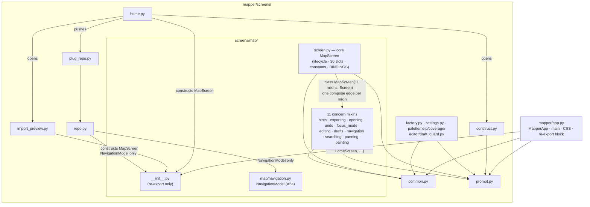

# Design proposal — mapper — Batch 2026-10-09-modular-batch

> **Artifact language.** Canonical **English scaffold**; generate in the batch's language
> The normative rules below are language-independent. **Where that language is declared:**
> `state.json`'s `language` key in `core` and `full`.

> **Reserved field names.** The **field names and block keywords below are language-independent** — the
> validator parses them literally and they are never translated:
> `Design proposal` · `7 · Forward-applicability table` · `⏸ DEFER`
> Everything else on this page — headings, guidance, the prose in every cell — is translated with the batch.
> **One strategy, not two:** the flow ships no alias table, so a translated label is read as an ABSENT one and the rule keyed on it reports a true-sounding silence.
> **Why a HEADING is reserved here and a FIELD NAME everywhere else:** `C-49`'s artifact is the §7 TABLE, and a rule that read a summary bullet instead of the rows would be reading a claim about the table rather than the table. `V52` therefore keys on this document's own H1 and on the §7 heading, which is why both are on the machine plane. **And one FLOW-WIDE reserved token, read out of this artifact by `V42` no matter which template minted it:** `⏸ DEFER`. It is a MARKER rather than a field name, which is why it is stated here *and* in `/dev-flow` §Language of artifacts rather than in a per-template list — a deferral can be written in any batch artifact, including the ones that carry no block at all.

> **Owed in.** `core` by trigger · `full` ✓
> **Source:** `/dev-flow-init` step 4's seed-by-mode table, which is this fact's one home. A mode marked `—` **does not owe this artifact, and its absence is not an omission**; `by trigger` means the station exists only when the `triggers` block fired, and `stations_active` in `state.json` is the authority for *this* batch. Where a SECTION or a gate row is owed more narrowly than the artifact, it says so on the row.

> **Where this lives: the VAULT + Drive**, not the repo — it is deliberation, and its traceability to
> code is weak. It is **cited by id** from the repo (`PDR-<batch_id>#D<n>`), never copied.
> What binds code — a frozen interface, a design characteristic — also lands in the **repo**, in the
> requirement or in `docs/ARCHITECTURE.md`. *The vault keeps the deliberation; the repo keeps the commitment.*

> **The forward-applicability rule (ISO/IEC/IEEE 15288).** Everything below must be NAMED as the input
> of a later activity. **If a section of this proposal is nobody's input, delete it — it does not belong
> in the PDR.** That rule is what allows this document to cost half the batch without being waste.

| Field | Value |
|---|---|
| Id | `PDR-2026-10-09-modular-batch` |
| Requirements covered | `HLR-MOD.1 v2 · HLR-MOD.2 v2 · HLR-MOD.3 v2 · HLR-MOD.4 v2 · HLR-MOD.5 v2 · HLR-MOD.6 v2 · HLR-MOD.7 v2 · LLR-MOD.1.1 v2 · LLR-MOD.1.2 v2 · LLR-MOD.1.3 v2 · LLR-MOD.2.1 v2 · LLR-MOD.2.2 v2 · LLR-MOD.2.3 v1 · LLR-MOD.3.1 v2 · LLR-MOD.3.2 v2 · LLR-MOD.4.1 v2 · LLR-MOD.4.2 v2 · LLR-MOD.4.3 v2 · LLR-MOD.5.1 v2 · LLR-MOD.5.2 v1 · LLR-MOD.6.1 v2 · LLR-MOD.6.2 v2 · LLR-MOD.7.1 v2 · LLR-MOD.7.2 v2` — every requirement amended by ledger entries LED-2026-10-09-modular-batch.1–.9 is at v2; only LLR-MOD.2.3 and LLR-MOD.5.2 (Ledger: none) remain at v1 |
| Modules touched (from `docs/ARCHITECTURE.md`) | `app` · `screens` · `map screen` (the §2 rows amended as TARGET by this batch) |
| Triggers that fired | `A1 · A2 · A3 · A4 · B1 · E1 · F1` (A2 for `screens/factory.py`'s B-02 edge; D1/D2 did not fire) |
| Author / reviewers | `architect` · `qa-reviewer` |

---

## 1 · Objective and scope

Split `mapper/app.py` (5255 lines; R-009's re-open condition is met) by mechanism A — one plain mixin
class per `MapScreen` concern, composed into the core class — so that every concern and every sibling
screen is a disjoint file that a later product lane can edit without sharing a file with any other lane
(US-001, the operator's «primordial»). The move is behaviour-preserving: the app paints byte-identically
(US-002), and the suite keeps importing and patching what it does today (US-003). Scope is file motion
only — every moved body is cut/paste, no string, key, colour or layout change; the post-B11 product
lanes themselves are out of scope.

## 2 · Modules and boundaries

The authoritative module map is `docs/ARCHITECTURE.md` §2 — this batch lands the code that makes the
three amended TARGET rows true. Summary (cite, do not duplicate):

| Module | What it owns here | What it exposes | What it must NOT reach into |
|---|---|---|---|
| `app` (`mapper/app.py`) | `MapperApp`, `main`, the `CSS` block, and a permanent re-export block for every moved name (21 names, premise 10); the F4 patch names do NOT live here (§4) | `MapperApp`, `HomeScreen`, `MapScreen`, `RepoScreen`, … via re-exports | Any `Screen` subclass other than `MapperApp`, any MapScreen concern method (ARCHITECTURE §2 `app` row) |
| `screens` (`mapper/screens/common.py`, `prompt.py`, `construct.py`, `home.py`, `repo.py`, `plug_repo.py`, `import_preview.py` — new) | `common`: shared helpers, hint-string constants, `MapHintLine` (A1, ARCH-8); `prompt`: the four literal modals (A2); `construct`: `ConstructScreen` (A3); the four sibling screens per the MOD-REQ2 order (A5b, A6, A7, A4) | The owned classes/helpers, re-exported through `mapper.app` | `mapper.app` in any form or scope (B-02 closes at A2); the sibling screens that construct `MapScreen` import it from `mapper.screens.map`, never from `mapper.app` (ARCH-1) |
| `map screen` (`mapper/screens/map/` — new package) | `__init__.py` re-export only; `screen.py` the core class (lifecycle concern, all 30 state slots, every class constant, `BINDINGS`); 11 concern modules, one mixin each (`hints`, `exporting`, `opening`, `undo`, `focus_mode`, `editing`, `drafts`, `navigation`, `searching`, `panning`, `painting`) | `MapScreen` (via the package re-export only), `NavigationModel` | Anything outside `MapScreen`: no `mapper.app` import, no sibling-concern import, no `BINDINGS`/`DEFAULT_CSS`/`@on` in a mixin (ARCHITECTURE §2 `map screen` row and §3 `screens/map` row) |

- Boundaries respected as declared in `docs/ARCHITECTURE.md`: ✓ — no §2/§3 boundary moves in this design; the TARGET rows were already amended on the trunk (ARQ change), this PDR only freezes and sequences against them.

## 3 · Diagrams

Import graph AFTER the split (mechanism A landed; the only legal direction is `app` → `screens/map`,
never the reverse):

> One-line note (C3): AT-068/AT-069/AT-070/AT-071 are the **Layer-B acceptance of the maintainer
> story (US-001)**; their shipped surface is the source tree itself — the layer column in §5 below
> (0/A for these four) marks the *mechanism* (structural/white-box checks on the tree), not a
> different acceptance layer, and requirements §5.1 already lists all four under Layer B.

No edge into `app` exists anywhere under `screens/` (the banned `screens → app` cycle; LLR-MOD.6.2
asserts both AST forms at any scope are absent). Concerns communicate through `self` on the composed
class, never through each other's modules.

Spine order (serial; the MOD-REQ2 reorder per LED .1/.6/.9) with the fork point:

```mermaid
flowchart LR
    inc0["Inc-0<br/>6 test generalisations<br/>parallel sub-lanes"] --> a1["A1<br/>common + MapHintLine"]
    a1 --> a2["A2<br/>prompt modals<br/>B-02 closed"]
    a2 --> a3["A3<br/>construct"]
    a3 --> a5a["A5a<br/>map/navigation.py<br/>NavigationModel only"]
    a5a --> b0["B0<br/>MapScreen wholesale →<br/>screens/map/screen.py"]
    b0 --> a5b["A5b<br/>repo"]
    a5b --> a6["A6<br/>plug_repo"]
    a6 --> a7["A7<br/>import_preview"]
    a7 --> a4["A4<br/>home (last sibling)"]
    a4 --> b1["B1 hints<br/>SPIKE + pilot"]
    b1 --> b2["B2 exporting"]
    b2 --> b3["B3 opening (+osopen allow-list)"]
    b3 --> b4["B4 undo"]
    b4 --> b5["B5 focus_mode"]
    b5 --> b6["B6 editing"]
    b6 --> b7["B7 drafts (funnel)"]
    b7 --> b8["B8 navigation mixin"]
    b8 --> b9["B9 searching<br/>(MAX_RENDER_NODES repoint)"]
    b9 --> b10["B10 panning"]
    b10 --> b11["B11 painting<br/>(refresh_canvas, last)"]
    b11 --> b12["B12<br/>map validation +<br/>census-diff freeze"]
    b11 -.->|"product lanes fork HERE —<br/>each lane owns exactly one<br/>disjoint concern file"| lanes["parallel product lanes<br/>(post-batch)"]
```

## 4 · Interfaces that change — and which ones FREEZE

| Interface | Current | After | Consumers | **Frozen for the fork?** |
|---|---|---|---|---|
| F1 — state roster | 30 attributes of `MapScreen` declared in `app.py`'s `__init__` | Same 30 slots, declared only in the core `__init__` of `screens/map/screen.py`; writer matrix is the discipline (`_last_save_error`'s external writer `_save_or_toast(screen=…)` signature included) | all 11 mixins (via `self`) | **YES — sealed at this PDR; binding from B0; made mechanical by the B12 census-diff (LLR-MOD.7.2). Untouchable before Spine B starts (i.e. after B0) and inside every lane** |
| F2 — cross-concern method surface | `refresh_canvas`, `_view_state`, `_search_order`, `_guard_draft`, `guard_open`, `has_pending_draft`, `_save_draft`, `_clamp_pan`, `_event_toast`, `_push_snapshot`, `_repoint`, `_establish_graph`, … (the full in-edge roster of ARCHITECTURE §4) as ordinary methods of one class | Identical names/signatures, now resolved through the mixin MRO; a concern may call only F2 methods of another concern | the 12 map modules among themselves; `MapperApp` via F5 | **YES — sealed at this PDR (before Spine B = after B0); B12 census-diff reddens any drift** |
| F3 — core class surface | `BINDINGS`, `DEFAULT_CSS`-free, class constants (`KEY_SCOPE`, `PAN_STEP_X/Y`, `MIN_CANVAS_WIDTH`, `REVEAL_MARGIN_CELLS`, `METER_STEPS`, `_TOAST_CHROME_CELLS`, `UNDO_DEPTH`, `EXPORT_*`, `_MINIMAP_*`, `_FOCUS_REGIONS`, …) on the monolithic class | Identical declarations, only on the core `screen.py` class; mixins banned from `BINDINGS`/`DEFAULT_CSS`/`@on`/constant shadowing (spike rule: silently ignored — `evidence/arq-mro-spike.transcript`) | mixins (read-only), `app` | **YES — sealed at this PDR; constant roster AST-derived at Inc-0 so it cannot rot (LED .4)** |
| F4 — patch surface | **Eight patch-site names** (premise 4): seven module-global targets patched on the `mapper.app` module object, plus `GitHubConnector.fetch` patched as a class attribute of the shared class | Each of the 7 module-global targets is a module-global of the module that READS it, repointed in the increment that moves the reader: `refusal_sentence` → `screens/common.py` (A1); `preview_csv` → `screens/home.py` (A4 — read by `HomeScreen` at app.py:1090, NOT by `_ImportPreviewScreen`; patch sites `tests/test_inc9c.py:114`, `tests/test_inc9n.py:285`); `LayeredRenderer` → `screens/import_preview.py` (A7 — read by `_ImportPreviewScreen` at app.py:1137); `save_svg` → `screens/map/exporting.py` (B2); `MAX_RENDER_NODES` + `SearchIndex` → `screens/map/searching.py` (B9); `pan_extent` → `screens/map/panning.py` (B10). `GitHubConnector.fetch` is a class-attribute patch on the shared class object — survives the move, **no repoint** (ARCH-11) | `tests/` patch sites (14 sites across 7 files) | **Policy frozen at this PDR; each name freezes when its repoint lands (per-increment guard, LLR-MOD.3.2); the dropped F4 lazy-read design is recorded rejected in §6** |
| F5 — app↔screen surface | `MapperApp.action_quit` calls `isinstance(s, MapScreen)`, `s.has_pending_draft()`, `s.guard_open()`, `s._guard_draft(proceed, on_hold)`; widgets rely on the `on_*` handler names | Identical surface, same class object through the re-export; handler names kept pairwise-disjoint across the 12 modules (spike: every MRO class defining an `on_*` runs) | `app`, `widgets` | **YES — sealed at this PDR (before Spine B = after B0); a rename is trigger A3 back to the trunk** |

**A frozen interface is not touched inside a lane.** If a lane needs to change one, the work returns to
the trunk — that is trigger **A3**. Freeze timing: F1–F3 and F5 are sealed by this PDR and bind from B0
onward (before Spine B starts); F4's policy is sealed now and each patch name freezes at its repoint
increment; none of the five is editable inside a post-B11 product lane.

## 5 · Proposed test cases

| Id | Layer (0 unit / A white / B black / UX) | What it asserts | **The mutation that would turn it RED** |
|---|---|---|---|
| AT-065 — `tests/test_mod_parity.py -k at065` (HLR-MOD.4, LLR-MOD.4.2) | B | The scripted session (open map, move, search, toggle view, export, quit) driven with real keys through `MapperApp(tmp_path)` + `pilot.press` paints byte-equal lines to the committed text goldens (`mod_parity_118.txt`, `mod_parity_87.txt`, sha256-verified) at both widths, after every increment gate | A one-token change to a painted string in a tmp copy of the product module → line diff RED (a missing golden is NOT the control) |
| AT-066 — `tests/test_mod_dispatch.py -k at066` (HLR-MOD.2, LLR-MOD.2.3) | B | The B1 pilot: a bound action and an `on_*` handler resolve through the hints mixin with real keys; hint line equals the pre-B1 capture | `BINDINGS` moved off the core class into a mixin → bound key silently drops (spike rule 1) → capture RED |
| AT-067 — `tests/test_mod_compat.py -k at067` (HLR-MOD.3, LLR-MOD.3.2) | B | The patch-surface contract: with `MAX_RENDER_NODES` patched one below the map size the refusal paints at the patched limit, and a patched `refusal_sentence` shows its marker — through the shipped screens and the repointed module-globals | One repoint skipped in a tmp copy → the patch stops biting while the rest of the suite stays green → refusal/limit assertion RED |
| AT-068 — `tests/test_mod_structure.py -k at068` (HLR-MOD.1) | 0 | The shipped tree: 20 expected files present and owning their names; `mapper/app.py` ≤ 400 lines, no `Screen` subclass other than `MapperApp`; every census method has exactly one home | One concern method left in (or returned to) `app.py`, or a re-export dropped → owner/home assertion RED |
| AT-069 — the six Inc-0 files, `-k at069` (HLR-MOD.5, LLR-MOD.5.1) | A | `test_draft_hygiene.py`, `test_darkside_census.py`, `test_keymap.py`, `test_en5.py`, `test_en7.py`, `test_app_imports_used.py` locate their pins by content across the package (each darkside pin exactly one home); per-file AST assertion counts ≥ the pinned baselines (9/55/35/34/37/2); `test_keymap.py`'s scanned module set is derived by `pkgutil.walk_packages(mapper)` | A pinned darkside line duplicated into a second module → two-homes RED; the keymap module list hand-pinned again → walk_packages equality RED; one assertion deleted → count-baseline RED |
| AT-070 — `tests/test_mod_deps.py -k at070` (HLR-MOD.6, LLR-MOD.6.1) | A | 0 occurrences of either AST import form (`import mapper.app` any alias, `from mapper.app import …`) anywhere under `mapper/screens/` at any scope; `factory.py`/`settings.py` hold their helper imports at module level from `screens/common.py`/`screens/prompt.py` | Any one of the four B-02 function-local imports restored in a tmp copy → ban assertion RED |
| AT-071 — `tests/test_mod_deps.py -k at071` (HLR-MOD.7, LLR-MOD.7.1) | A | The amended §3 rules on the shipped ASTs: `screens/map/screen.py` MAY import its 11 concern modules (it composes `MapScreen` from them); the concern modules never import each other; nothing under `mapper/screens/` imports `mapper.app`; only `app`, `screens/repo.py` (`NavigationModel` only), `screens/home.py` + `screens/import_preview.py` (`MapScreen` only, from `mapper.screens.map`) import `screens/map`; `open_external` call sites ⊆ {`app`, `screens/map/opening`} | A synthetic module-level `import mapper.app` added to any `screens/map` module, or a concern module importing a sibling concern → rule assertion RED |
| `tests/test_mod_structure.py` — `-k spine_a` / `b0` / `spine_b` (LLR-MOD.1.1–1.3) | 0 | Per-spine-step structural checks as package-root functions: the 7 sibling modules exist, define their names, and re-export with `is` identity; `inspect.getfile(MapScreen)` ends with `screens/map/screen.py`; `MapScreen.__mro__` holds the 11 mixins ahead of `Screen` | Any structural checker run on a tmp-copy mutant whose re-export is removed → identity assertion RED |
| `tests/test_mod_dispatch.py` — `-k bindings` / `disjoint` (LLR-MOD.2.1, LLR-MOD.2.2) | 0 | Exactly 1 `BINDINGS` and 0 `DEFAULT_CSS` across the mixins; 0 `@on`-decorated handlers in any mixin; the AST-derived constant roster (incl. `AUTO_FOCUS`, `MINIMAP_ROWS`) appears exactly once across the 12 modules; 0 pairwise method-name collisions | Duplicate `on_resize` in two mixins → the call-count assertion RED (an idempotent handler may change no paint, so paint cannot carry this RED — LED .5); a `BINDINGS` declared in a mixin → AST ban RED |
| `tests/test_mod_compat.py` — `-k reexport` / `patch_guard` (LLR-MOD.3.1, LLR-MOD.3.2) | A | All 21 imported names (premise 10) resolve from `mapper.app` with object identity to their defining module; the AST guard proves every patch site in `tests/` targets a module-global of the module that actually READS the patched name (reader-checked, not name-bound — ARCH-10) | Remove one re-export → import-resolution RED; repoint `LayeredRenderer` to a module that binds but does not read it → guard RED |
| `tests/test_mod_bodies.py` (LLR-MOD.4.3) | 0 | Per-method `ast.dump` of every census method equals the Inc-0 baseline JSON (pinned path + sha256), each method exactly once across the package; no new module references an undefined global | A one-token mutation inside any moved body in a tmp copy → baseline-diff RED; one import deleted in a new module → undefined-global RED |
| `tests/test_mod_census.py` (LLR-MOD.7.2) | 0 | Re-runs `spike/ast_census.py` over the package and diffs against the committed `spike/census.json` — F1 writer matrix and F2 surface frozen mechanically | A synthetic second writer for any F1 attribute added to a tmp copy → census-diff RED |
| `tests/test_arch_osopen_callers.py` · `tests/test_inc9p.py` · `tests/test_inc9q.py` (LLR-MOD.5.2) | A | The extraction-riding follow-ups land in their increments: the osopen allow-list gains `screens/map/opening.py` at B3, and the `test_inc9p.py`/`test_inc9q.py` "one home" arms extend their scanned set at B9 | The allow-list extended before the call site moves, or not extended after → follow-up RED |
| `tests/test_mod_deps.py` — `-k no_app_import` (LLR-MOD.6.2) | 0 | 0 AST-detected occurrences of either `mapper.app` import form (`import mapper.app` any alias, `from mapper.app import …`) anywhere under `mapper/screens/` at any scope; the sibling screens import `MapScreen` from `mapper.screens.map` | Either banned import shape restored in a `screens/` module of a tmp copy → ban assertion RED |
| `tests/test_mod_deps.py` — `-k arch` (LLR-MOD.7.1) | 0 | The amended §3 rules on the shipped ASTs: `screens/map/screen.py` MAY import its 11 concern modules (it composes `MapScreen` from them), the concern modules never import each other, and nothing under `mapper/screens/` imports `mapper.app` | A concern module importing a sibling concern module in a tmp copy → rule assertion RED |
| LLR-MOD.4.1 — the full suite at every increment gate and at P4 | — (a gate RUN, not a test case) | `python -B -m pytest -q -p no:cacheprovider tests/` exits 0 after every increment gate and at P4 — 0 failed against the P0 baseline (2941 passed / 3 xfailed / 0 failed) | Any behaviour drift in the moved code reddens the suite at the gate |

**Declared here, at authoring time, not at execution time.** A proposed case whose reddening mutation
cannot be named is not yet a test case — it is a hope. Layer 0 applies where the unit has cyclomatic
complexity ≥3 **or** transforms data crossing a declared module boundary — here, every structural
checker is a package-root function run GREEN on the real tree and RED on a tmp-copy mutant (LED .4).

## 6 · Risks and rejected alternatives

> **Rejected alternatives are owed WHERE A REAL DECISION EXISTS**, otherwise `n/a — <the decision already made, and by what>` — an existing pattern, a frozen interface, a prior ADR. **Do not fabricate a second design to fill this section:** two invented options make an arbitrary pick look deliberated, which is worse than one honest constraint. (the same ruling as `agents/architect.md` §Evidence checklist and the PDR row — one obligation, three stations, and closing it at one of them is `C-14`.)

| Alternative considered | Why it was rejected |
|---|---|
| Mechanism B — collaborator objects (`self._search = SearchController(self)`) | Textual dispatch is not preserved for free: every `action_*`/`on_*` must stay on `MapScreen` and delegate, so the diff stops being cut/paste and becomes a rewrite of ~30 dispatchers plus all 25 `refresh_canvas` call sites on a 3452-line class — the opposite of behaviour-preserving. Kept only as the documented fallback (spike R-1) if the B1 pilot contradicts the MRO evidence. |
| Mechanism C — free functions per concern with thin shim methods | Worst of both: the shim methods stay in `screen.py` (feature work still collides on the shared file — the very collision the batch exists to remove) AND every body is rewritten `self.x` → `screen.x`. |
| F4 call-time lazy reads — readers do function-local `import mapper.app` to read the patch names | Rejected by ruling ARCH-2 / LED .2: the lazy read is itself a `screens → app` back-edge, and a re-exported or privately copied name would silently kill the patches while the suite stayed green. Superseded by the repoint policy (each target a module-global of its reading module, guard-checked). |
| ARCH-1 alternative — sibling screens stop constructing `MapScreen` and open maps through a new `MapperApp` method | Would change the F5 app↔screen surface (an A3 returned to the trunk), rewrite the 6 construction sites and their tests, and still leave every screen in `app.py` — the disjoint-file goal undelivered. Premise 11 shows the dependency runs sibling → `MapScreen` only, so moving `MapScreen` first (B0) and importing it from `mapper.screens.map` is the legal, cheaper edge. |

*(Recording the rejection is what stops the same option being re-proposed in three batches.)*

Risks that remain, with their guard (full register: requirements §6.3, spike §7):

- **R-1 silent double dispatch** — an `on_*` in two mixins runs twice; guarded by the disjointness call-count guard and the B1 pilot. If a future Textual upgrade changes MRO dispatch, the guards redden first (the spike rules are version-pinned to 8.2.8).
- **R-2/R-3 shared state and funnels** — 30 attributes, 15 multi-writer; `refresh_canvas` 25 sites in 9 concerns; `_guard_draft` funnels nav/edits/views. Mitigation: `self.*` byte-identical, F1/F2 frozen and made mechanical at B12.
- **R-4 patch surface** — the failure mode is silent; both the bite checks (AT-067) and the reader-checked AST guard are executable, per increment.
- **R-5 silent import/name drift** — one guard (LLR-MOD.2.2) carries the disjoint-names ban, the mixin `@on`/`DEFAULT_CSS`/`BINDINGS` ban, and the no-patch-name-import-from-`mapper.app` ban.
- **R-6 pin rot** — Inc-0 lands before any move; a pin found ungeneralisable returns Spine A only to the trunk as an A3, never an in-lane improvisation.
- **R-7 CSS selector drift** — no class is renamed; AT-065 catches a styling break as a painted diff.
- **R-8 import cycle** — the MOD-REQ2 reorder lands helpers/`NavigationModel` before B0; LLR-MOD.6.2 bans the `mapper.app` edge in any form or scope (verified by the round-2 spine probe: 0 illegal edges).
- **R-9 serial calendar cost** — accepted: 22 increments (Inc-0 + the nine spine/sibling steps A1, A2, A3, A5a, B0, A5b, A6, A7, A4 + B1–B11 + B12), each ≤ 4 source files, is the price of the disjoint-file payoff (the parallel alternative — pre-declaring all mixin shells at B0 — needs a 13-file cap waiver and was rejected).
- **Doc risk (watch item, not product):** the contract is 69.7k characters against a 54k budget; the trim candidates are non-normative (refinement logs, rationale, §6.2/§6.3 prose) and trimming was deferred at review round 2 — recorded so a later batch does not mistake the size for scope growth.

## 7 · Forward-applicability table — **the section that makes this document honest**

| Output of this PDR | Named consumer downstream | Where the consumer will read it |
|---|---|---|
| Mechanism A (plain mixins on the core class) + the BINDINGS-on-core rule | B1 spike increment and every B2–B11 extraction; the dispatch guards | `03-increments/increment-001.md` B1 step; `tests/test_mod_dispatch.py` (`-k pilot`/`bindings`/`disjoint`, AT-066); ARCHITECTURE §2 `map screen` row |
| F1 state roster freeze (30 slots + writer matrix + `_save_or_toast` signature) | every Spine-B increment (mixins may not add state); B12 mechanical freeze | `tests/test_mod_census.py` (LLR-MOD.7.2) diffing `spike/census.json`; ARCHITECTURE §4 F1 row |
| F2 cross-concern method surface (names + signatures) | every Spine-B increment (the only callable cross-concern set); B12 census-diff | `tests/test_mod_census.py`; the call-site byte-identity oracle `tests/test_mod_bodies.py`; ARCHITECTURE §4 F2 row |
| F3 core class surface + AST-derived constant roster | B0 (what `screen.py` must declare); Inc-0 (roster capture from the pre-split AST) | `tests/test_mod_dispatch.py -k bindings` (LLR-MOD.2.1); ARCHITECTURE §4 F3 row |
| F4 repoint map (7 module-global targets → named reading modules per increment; `GitHubConnector.fetch` survives) | the per-increment repoints (A1, A4, A7, B2, B9, B10) and their gates | `tests/test_mod_compat.py -k patch_guard` + the patch-carrying files (LLR-MOD.3.2, AT-067); ARCHITECTURE §4 F4 row |
| F5 app↔screen surface (no renames; handler-name disjointness) | B0's wholesale move and A4/A6/A7 (sibling construction sites) | `tests/test_mod_parity.py` (AT-065 scripted session), `tests/test_mod_deps.py -k arch`; ARCHITECTURE §4 F5 row |
| The 21-name re-export block policy | every A increment + B0 (each adds its `from … import` block to `app.py`) | `tests/test_mod_compat.py -k reexport` (LLR-MOD.3.1); ARCHITECTURE §2 `app` row |
| Inc-0 generalisation plan per test (incl. `test_keymap.py` → `pkgutil.walk_packages`) | the six Inc-0 sub-lanes before any move | the six generalised test files with `-k at069` (LLR-MOD.5.1, HLR-MOD.5 numeric baselines) |
| Proposed test cases (§5) with named reddening mutations | Phase-3 increments author their gate checks from these rows; the DDR verifies each AT owns its node with an executed RED | `04-validation.md`; `design/DDR-2026-10-09-modular-batch.md`; the increment packets under `03-increments/` |
| Spine order + fork preconditions (MOD-REQ2 reorder) | the serial increment plan and the post-B11 lane declarations | `docs/ARCHITECTURE.md` §6 worksheet (order constraints); `PLAN.md` roadmap; `03-increments/increment-001.md` |
| design → requirement traceability | the matrix and the DDR | `04-validation.md` traceability matrix (each HLR/LLR row cites this PDR's §4/§5 rows) |

- ⚠ Any row whose consumer column is empty: **remove the output, or explain why it is being produced.** — none; every row names a consumer.

## 8 · Parallelisation plan *(only if the batch forks)*

The batch's own spine is **serial**: every extraction increment deletes lines from the shared
`mapper/app.py` (Spine A, B0) or `screens/map/screen.py` (Spine B), so any two extraction increments
collide on that file and `modules(A) ∩ modules(B) = ∅` fails at file granularity. The only in-batch
parallelism is Inc-0, whose six test-only generalisations are mutually disjoint files:

| Lane | Modules / layer | Files it owns | Agent |
|---|---|---|---|
| Inc-0 sub-lane 1 | `tests` / layer A | `tests/test_draft_hygiene.py` (MapScreen arms via `inspect.getfile`) | worker |
| Inc-0 sub-lane 2 | `tests` / layer A | `tests/test_darkside_census.py` (14 pins by content, exactly-one-home) | worker |
| Inc-0 sub-lane 3 | `tests` / layer A | `tests/test_keymap.py` (package-wide chord scan; module set via `pkgutil.walk_packages`) | worker |
| Inc-0 sub-lane 4 | `tests` / layer A | `tests/test_en5.py` (Spanish census scans the package) | worker |
| Inc-0 sub-lane 5 | `tests` / layer A | `tests/test_en7.py` (absence check over package sources) | worker |
| Inc-0 sub-lane 6 | `tests` / layer A | `tests/test_app_imports_used.py` (unused-import census per new module) | worker |
| Spine (Inc-0 → A1 → A2 → A3 → A5a → B0 → A5b → A6 → A7 → A4 → B1…B11 → B12) | trunk, serial, one increment at a time | `mapper/app.py`, then `mapper/screens/map/screen.py` + one new module per step | orchestrator |
| Product lanes (post-batch) | one concern module each, F1–F5 consumed read-only | singleton file sets, e.g. `screens/map/searching.py` | future batch workers |

- `modules(lane_i) ∩ modules(lane_j) = { }` — or same domain / different layers with the interface frozen: ✓ — the six Inc-0 lanes touch only test files, pairwise disjoint; the spine is a single serial trunk; post-B11 lanes own singleton concern files.
- **File sets are disjoint** (not just modules — two lanes may not edit the same file, not even different regions): ✓ — Inc-0 sub-lanes each own exactly one test file; no two spine increments run concurrently; `spike/` evidence files are read-only inputs.
- Family-B reverse census run **per lane and shared** before forking: ✓ — F2 (the cross-concern surface) is the reverse census, sealed at this PDR and made mechanical by B12 (`tests/test_mod_census.py`); the disjoint-names guard (LLR-MOD.2.2) runs at every spine gate.
- Trunk-only artifacts (requirements · traceability · backlog · SPEC) are written **only** by the trunk: ✓ — this PDR, `01-requirements.md` and `docs/ARCHITECTURE.md` are written only by the orchestrator; lanes receive them read-only.

Product lanes fork **only after Inc-B11**, when the 11 concern modules exist as disjoint files; the
batch's deliverable is the fork, not in-flight parallelism (requirements §2.8).
